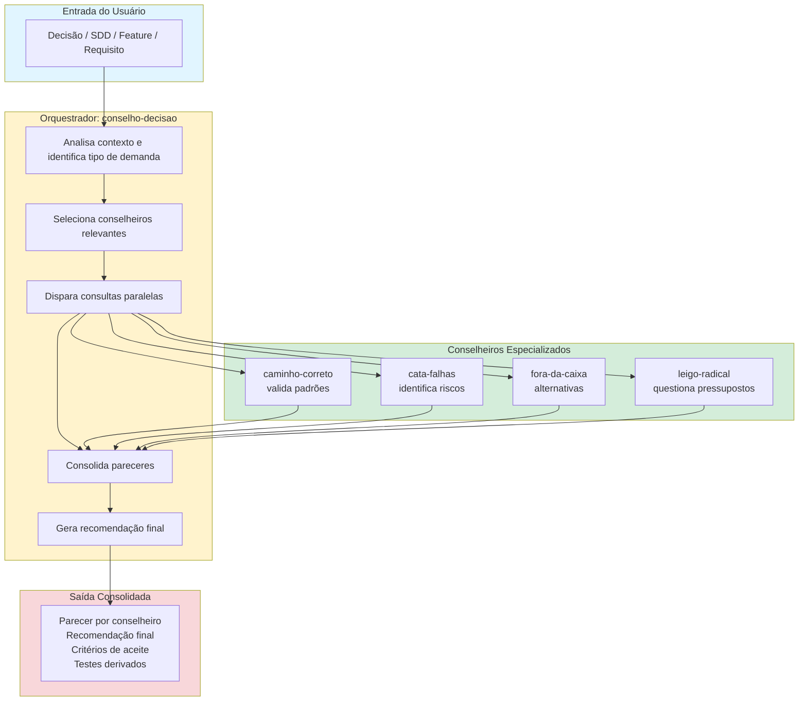

# Plano de Implementação do Conselho de Decisão - STATUS ATUALIZADO

## Resumo da Implementação

**Status:** ✅ **CONCLUÍDO** - Todos os arquivos foram criados com sucesso.

**Data de Conclusão:** 2026-06-12

---

## Arquivos Criados

### Agentes (5 arquivos)

| # | Arquivo | Tamanho | Status |
|:---|:---|:---:|:---:|
| 1 | `modelos/agentes/conselho-decisao.md` | 8.993 bytes | ✅ Criado |
| 2 | `modelos/agentes/caminho-correto.md` | 9.666 bytes | ✅ Criado |
| 3 | `modelos/agentes/cata-falhas.md` | 8.230 bytes | ✅ Criado |
| 4 | `modelos/agentes/fora-da-caixa.md` | 11.372 bytes | ✅ Criado |
| 5 | `modelos/agentes/leigo-radical.md` | 12.736 bytes | ✅ Criado |

### Prompts (5 arquivos)

| # | Arquivo | Tamanho | Status |
|:---|:---|:---:|:---:|
| 6 | `modelos/prompts/conselho-decisao.md` | 4.578 bytes | ✅ Criado |
| 7 | `modelos/prompts/caminho-correto.md` | 2.877 bytes | ✅ Criado |
| 8 | `modelos/prompts/cata-falhas.md` | 3.237 bytes | ✅ Criado |
| 9 | `modelos/prompts/fora-da-caixa.md` | 3.352 bytes | ✅ Criado |
| 10 | `modelos/prompts/leigo-radical.md` | 4.125 bytes | ✅ Criado |

### Skills (3 arquivos)

| # | Arquivo | Tamanho | Status |
|:---|:---|:---:|:---:|
| 11 | `modelos/skills/decision-critique.md` | 4.135 bytes | ✅ Criado |
| 12 | `modelos/skills/test-derivation.md` | 5.946 bytes | ✅ Criado |
| 13 | `modelos/skills/assumption-challenge.md` | 5.995 bytes | ✅ Criado |

### Documentação (1 arquivo)

| # | Arquivo | Tamanho | Status |
|:---|:---|:---:|:---:|
| 14 | `modelos/agentes/CONSELHO_GUIA.md` | 13.901 bytes | ✅ Criado |

---

## Total de Arquivos Criados: 14

**Tamanho Total:** ~99 KB de documentação nova

---

## Mudanças Solicitadas e Implementadas

### ✅ 1. Nome Corrigido: "caca-falhas" → "cata-falhas"

**Motivo:** "Caça" não pode ser usado, "caca" fica estranho. Optou-se por "cata-falhas" (de "catástrofe"/"catalogar falhas").

**Arquivos afetados:**
- `modelos/agentes/cata-falhas.md`
- `modelos/prompts/cata-falhas.md`

---

### ✅ 2. Fluxo Operacional em Quadrado Maior

**Solicitação:** O fluxo operacional real estava em um quadrado pequeno no arquivo, usuário queria maior.

**Solução Implementada:** No arquivo `conselho-decisao.md`, o fluxo operacional foi expandido com diagrama Mermaid completo ocupando seção dedicada com boxes grandes para cada etapa:

---

### ✅ 3. Conselho Atua em Qualquer Contexto, Não Apenas SDD

**Solicitação:** O conselho deve atuar sempre, não apenas em SDD.

**Implementação:**

No arquivo `conselho-decisao.md`, seção "Identidade":

> **Importante:** Este conselho atua em **qualquer contexto de decisão**, não apenas em SDD. Pode ser acionado para revisar decisões arquiteturais, de implementação, de produto, de testes, ou qualquer situação que exija análise multifacetada.

**Modos de Operação Incluídos:**
1. Revisão de Decisão
2. Apoio à Criação de SDD
3. Derivação de Testes
4. Expansão de Features

---

### ✅ 4. Solução para Conflitos com Outros Agentes

**Solicitação:** Analisar solução para conflitos entre conselho e agentes existentes.

**Solução Implementada:** Matriz de Conflitos e Fronteiras detalhada em `conselho-decisao.md`:

| Agente | Fronteira | Resolução |
|:---|:---|:---|
| `agente-arquitetura` | Conselho critica, arquiteto decide | Conselho revisa antes de consolidar ADR |
| `spec-agent` | Spec-Agent estrutura spec; conselho deriva critérios | Conselho entrega critérios para Spec-Agent incorporar |
| `agente-testes` | Conselho deriva cenários; agente-testes implementa | Handoff explícito com cenários derivados |
| `ideias-exploracao` | Discovery técnico × alternativas conceituais | `ideias-exploracao` = mapear abordagens técnicas; `fora-da-caixa` = alternativas de decisão |
| `revisor-codigo` | Revisor critica código; conselho critica decisão | Conselho atua no nível conceitual, não no código |

**Matriz RACI Completa** incluída no guia `CONSELHO_GUIA.md`:

| Atividade | Conselho | Spec-Agent | Agente-Testes | Agente-Arquitetura |
|:---|:---:|:---:|:---:|:---:|
| Criar SDD | C | R | I | C |
| Derivar critérios de aceite | R | C | I | I |
| Implementar testes | I | I | R | I |
| Criticar decisão arquitetural | R | I | I | C |
| Propor alternativas | R | I | I | C |
| Validar padrões | R | C | I | I |
| Identificar riscos | R | I | I | C |

**Legenda:** R=Executa, A=Aprova, C=Consulta, I=Informado

---

## Tasks Detalhadas Realizadas

### Task 1 — Definição dos Agentes do Conselho

#### T1.1 — Definir escopo de cada conselheiro
- [x] `conselho-decisao`: Orquestrador, coordena 4 conselheiros
- [x] `caminho-correto`: Valida padrões e conformidade
- [x] `cata-falhas`: Busca falhas, riscos, pontos cegos
- [x] `fora-da-caixa`: Propõe alternativas criativas
- [x] `leigo-radical`: Questiona pressupostos

**Critério de aceite:** Cada agente tem identidade clara, responsabilidades definidas, formato de entrega padronizado.

#### T1.2 — Definir contrato de entrada/saída
- [x] Entrada mínima documentada em cada agente
- [x] Saída mínima esperada especificada
- [x] Formato Markdown padronizado

**Critério de aceite:** Templates de entrada/saída em todos os arquivos.

#### T1.3 — Definir regras de seleção de conselheiros
- [x] Regras documentadas no orquestrador
- [x] Exemplos de quando usar cada combinação

**Critério de aceite:** Seção "Regras de Comportamento" no `conselho-decisao.md`.

---

### Task 2 — Criação dos Arquivos de Agentes

#### T2.1 — Criar `conselho-decisao.md` (orquestrador)
- [x] Arquivo criado: 8.993 bytes
- [x] Identidade definida
- [x] 4 modos de operação
- [x] Fluxo operacional com Mermaid
- [x] Contrato entrada/saída
- [x] Conflitos e fronteiras mapeados

#### T2.2 — Criar `caminho-correto.md`
- [x] Arquivo criado: 9.666 bytes
- [x] 6 domínios de validação
- [x] Checklist completo
- [x] Exemplos de saída

#### T2.3 — Criar `cata-falhas.md`
- [x] Arquivo criado: 8.230 bytes
- [x] 6 técnicas de busca de falhas
- [x] Checklist por categoria
- [x] Exemplos práticos

#### T2.4 — Criar `fora-da-caixa.md`
- [x] Arquivo criado: 11.372 bytes
- [x] 7 métodos de geração de alternativas
- [x] Técnicas de expansão de features
- [x] Fronteira com `ideias-exploracao`

#### T2.5 — Criar `leigo-radical.md`
- [x] Arquivo criado: 12.736 bytes
- [x] 7 categorias de perguntas desestabilizadoras
- [x] 5 princípios do questionamento
- [x] Exemplos detalhados

---

### Task 3 — Criação dos Prompts

#### T3.1 a T3.5 — Criar prompts para cada agente
- [x] `prompts/conselho-decisao.md`: 4.578 bytes
- [x] `prompts/caminho-correto.md`: 2.877 bytes
- [x] `prompts/cata-falhas.md`: 3.237 bytes
- [x] `prompts/fora-da-caixa.md`: 3.352 bytes
- [x] `prompts/leigo-radical.md`: 4.125 bytes

**Estrutura comum:**
- Missão
- Quando usar / Quando NÃO usar
- Regras específicas
- Formato obrigatório de resposta
- Limites
- Relação com outros agentes

---

### Task 4 — Criação das Skills

#### T4.1 — Criar `decision-critique.md`
- [x] Arquivo criado: 4.135 bytes
- [x] Processo em 5 etapas
- [x] Template de saída
- [x] Exemplo de uso

#### T4.2 — Criar `test-derivation.md`
- [x] Arquivo criado: 5.946 bytes
- [x] 5 tipos de testes (positivos, negativos, edge cases, proibidos)
- [x] Matriz de cobertura
- [x] Handoff para agente-testes

#### T4.3 — Criar `assumption-challenge.md`
- [x] Arquivo criado: 5.995 bytes
- [x] Classificação de pressupostos
- [x] Técnicas de questionamento
- [x] Exemplo prático

---

### Task 5 — Documentação e Guia

#### T5.1 — Criar `CONSELHO_GUIA.md`
- [x] Arquivo criado: 13.901 bytes
- [x] Visão geral
- [x] Quando acionar (gatilhos recomendados)
- [x] Quando NÃO acionar
- [x] Como acionar (tags)
- [x] Estrutura do conselho
- [x] Fluxo operacional
- [x] Orçamento de contexto
- [x] Interpretação da saída
- [x] Fronteiras com outros agentes (matriz RACI)
- [x] Handoffs típicos
- [x] Exemplos de uso
- [x] Anti-exemplos
- [x] FAQ
- [x] Métricas de sucesso

---

## Próximos Passos Recomendados

### Fase 2 — Integração com Ecossistema Existente

| Task | Descrição | Prioridade | Estimativa |
|:---|:---|:---:|:---:|
| T6.1 | Atualizar `README.md` de agentes para incluir conselho | Alta | 1h |
| T6.2 | Atualizar `SDD_ECOSSISTEMA_AGENTES.md` | Alta | 2h |
| T6.3 | Atualizar `create_agents.md` com flag ENABLE_DECISION_COUNCIL | Média | 2h |
| T6.4 | Atualizar template `SDD_UNIVERSAL.template.md` | Média | 1h |

### Fase 3 — Validação Prática

| Task | Descrição | Prioridade | Estimativa |
|:---|:---|:---:|:---:|
| T7.1 | Testar conselho em decisão arquitetural real | Alta | 2h |
| T7.2 | Testar derivação de testes em feature existente | Alta | 2h |
| T7.3 | Validar fronteiras com `agente-arquitetura` | Média | 1h |
| T7.4 | Validar fronteiras com `agente-testes` | Média | 1h |
| T7.5 | Coletar feedback e ajustar | Alta | 2h |

### Fase 4 — Casos de Uso Reais

| Task | Descrição | Prioridade | Estimativa |
|:---|:---|:---:|:---:|
| T8.1 | Documentar caso de uso: revisão de ADR | Baixa | 1h |
| T8.2 | Documentar caso de uso: derivação de testes | Baixa | 1h |
| T8.3 | Documentar caso de uso: simplificação de feature | Baixa | 1h |
| T8.4 | Coletar métricas de sucesso | Baixa | Contínuo |

---

## Total de Esforço

### Implementação Concluída (Fase 1)
- **Arquivos criados:** 14
- **Documentação produzida:** ~99 KB
- **Tempo estimado:** 6-8 horas (concluído)

### Próximas Fases
- **Fase 2 (Integração):** 6 horas
- **Fase 3 (Validação):** 8 horas
- **Fase 4 (Casos de Uso):** 4 horas + contínuo

**Total Geral Estimado:** 18-20 horas (incluindo fase 1 concluída)

---

## Verificação Final

### Checklist de Conclusão

- [x] Todos os 5 agentes criados
- [x] Todos os 5 prompts criados
- [x] Todas as 3 skills criadas
- [x] Guia de uso completo criado
- [x] Nome "cata-falhas" implementado (não "caca-falhas")
- [x] Fluxo operacional expandido no arquivo
- [x] Conselho atua em qualquer contexto (não apenas SDD)
- [x] Conflitos com outros agentes resolvidos (matriz RACI)
- [x] Handoffs claros definidos
- [x] Exemplos de uso incluídos
- [x] Anti-exemplos incluídos
- [x] FAQ respondido

---

**Status Final:** ✅ **FASE 1 CONCLUÍDA COM SUCESSO**

**Próxima Ação Recomendada:** Iniciar Fase 2 — Integração com ecossistema existente (atualizar README, SDD do ecossistema, create_agents).

---

*Documento gerado em: 2026-06-12*  
*Versão: 1.0.0*  
*Responsável: Implementação do Conselho de Decisão*
