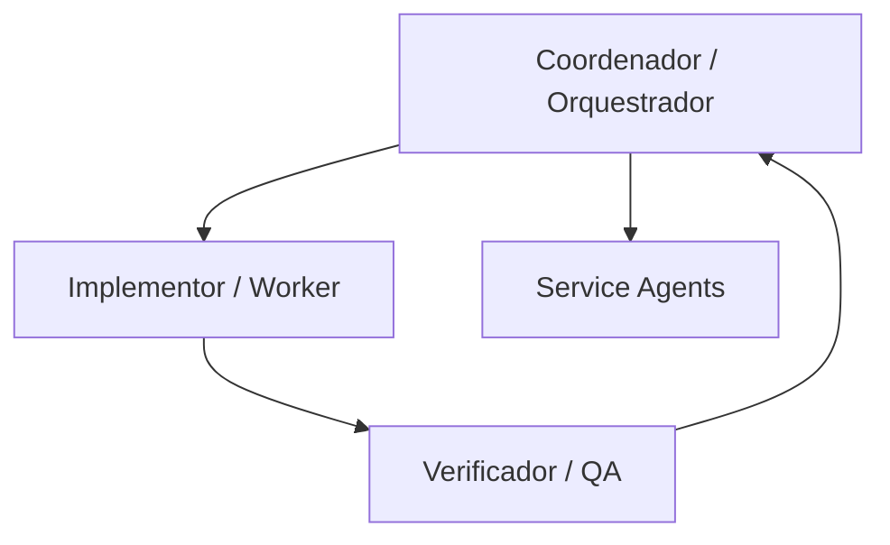
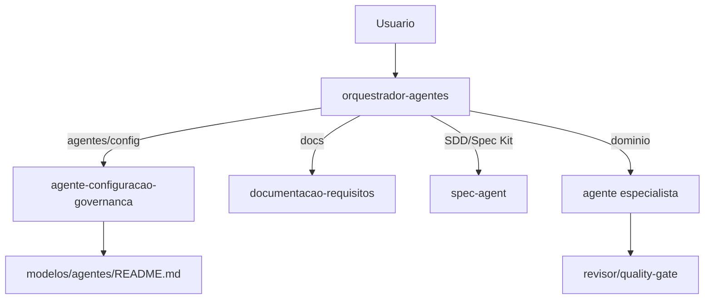

# Auditoria Tecnica - Arquitetura de Sistemas de Agentes Otimizados

| Campo | Valor |
|:---|:---|
| **Arquivo auditado** | `modelos/Arquitetura de Sistemas de Agentes Otimizados.docx` |
| **Referencia normativa** | `modelos/agentes/SDD_ECOSSISTEMA_AGENTES.md` |
| **Data** | `2026-06-03` |
| **Status da auditoria** | `REESCREVER ANTES DE IMPLEMENTAR` |
| **Escopo** | Governanca, agentes, skills, tags, README, SDD e fluxo de orquestracao |

---

## 1. Resumo executivo

### Estado geral do documento

O documento auditado e tecnicamente forte como ensaio conceitual sobre sistemas multiagentes. Ele cobre padroes relevantes: responsabilidade compartilhada, decomposicao de agentes, CIV (Coordenador-Implementor-Verificador), ECS, roteamento semantico, Skill-Memories, A2A, Spec-Driven Development e seguranca agentiva.

Como documento operacional para o ecossistema de agentes deste repositorio, ele esta incompleto. Nao define os agentes reais, nao referencia `modelos/agentes/README.md`, nao usa as tags padronizadas, nao explicita o guardiao de agentes e nao separa formalmente orquestracao de edicao de configuracao.

### Principais forcas

- Boa base conceitual para reducao de redundancia e decomposicao por responsabilidade.
- Recomenda padroes uteis para fluxos complexos: CIV, roteamento semantico e Spec-Driven Development.
- Reforca modularidade, interoperabilidade e documentacao de capacidades.
- Reconhece riscos de custo, contexto divergente e falhas em sistemas multiagentes.

### Principais riscos

- **P1 - Guardiao ausente:** o documento nao declara que somente `agente-configuracao-governanca` pode alterar agentes.
- **P1 - Orquestrador com autoridade ambigua:** menciona orquestrador, mas nao bloqueia edicao de configuracao pelo orquestrador.
- **P1 - Incompatibilidade com SDD:** nao mapeia agentes, tags, skills e permissoes conforme o SDD.
- **P2 - Excesso conceitual:** padroes como ECS e A2A aparecem sem traducao para arquivos Markdown reais do repo.
- **P2 - Falta de matriz operacional:** nao ha matriz agente x skill x prompt x permissao.

---

## 2. Conformidade estrutural

### O que esta bem definido

- Estrutura conceitual em secoes progressivas.
- Diferenca entre agentes de execucao e agentes de servico.
- Padrao CIV para separar coordenacao, implementacao e verificacao.
- Risco de redundancia comunicacional e necessidade de roteamento.
- Valor de heranca de habilidades via padrao Skill-Memories.
- Necessidade de especificacoes e validacao por fases.

### O que esta incompleto

- Nao lista os agentes reais do repositorio.
- Nao define `agente-configuracao-governanca`.
- Nao define `orquestrador-agentes` como coordenador sem permissao de edicao.
- Nao define `documentacao-requisitos` e `spec-agent`.
- Nao documenta `/guard`, `/docs`, `/sdd`, `/orchestrate`, `/go`, `/plan`, `/spec`, `/tasks`, `/review`.
- Nao define arquivos que cada agente pode ou nao pode alterar.
- Nao define como `modelos/agentes/README.md` deve ser atualizado.

### O que esta redundante

- Discussao de interoperabilidade A2A e Model Cards e extensa para o objetivo operacional atual.
- ECS e roteamento baseado em leilao sao apresentados como padroes fortes, mas sem criterio de aplicacao local.
- Ha sobreposicao conceitual entre "agentes de servico", "verificadores", "QA", "monitoramento" e "conformidade" sem mapear esses papeis aos agentes existentes.

### O que esta fora de padrao

- O documento nao segue o template `SDD_UNIVERSAL.template.md`.
- Nao possui metadados formais: versao, status, autores, revisores, escopo e referencias internas do repo.
- Nao usa o vocabulario normativo do SDD: guardiao, tags, README de agentes, Spec Kit local, permissoes/proibicoes.
- Nao protege explicitamente a configuracao padrao contra sobrescrita.

---

## 3. Analise por agente

O DOCX nao define agentes nomeados do repositorio. Ele define categorias ou papeis arquiteturais. Abaixo, a analise trata cada papel encontrado e seu ajuste necessario para o ecossistema real.

| Papel encontrado | Responsabilidade principal | Entradas | Saidas | Permissoes no DOCX | Restricoes no DOCX | Skills/capacidades | Conflitos | Ajuste necessario |
|:---|:---|:---|:---|:---|:---|:---|:---|:---|
| Desenvolvedor | Estrutura e limites do sistema | Requisitos, arquitetura, ferramentas | Interfaces, limites, politicas | Define arquitetura e ferramentas | Nao detalhado | Security of the system | Papel humano misturado com governanca de agentes | Mapear para humano responsavel + guardiao, sem transformar em agente executor |
| Agente | Decisoes em tempo de execucao | Tarefas, contexto, ferramentas | Resultados parciais, excecoes, retries | Decide execucao | Deve respeitar orcamento e sequencias | Runtime decisions | Generico demais | Substituir por agentes nomeados do README |
| Operador humano | Autorizacao e entrada exclusiva | Aprovacoes, credenciais, dados externos | Decisao humana | Aprova excecoes criticas | Nao automatizar credenciais | Human-in-the-loop | Correto, mas incompleto | Integrar como aprovador final no SDD |
| Worker Agents | Executam tarefas de dominio especifico | Requisicao de tarefa | Resultado de dominio | Executar tarefa | Escopo restrito | Stateless/stateful execution | Pode virar categoria vaga | Mapear para especialistas: Flutter, games, conteudo, API, testes |
| Service Agents | QA, conformidade, diagnostico, healing | Artefatos, logs, estado | Validacoes, recuperacao, relatorios | Capacidade compartilhada | Nao detalhado | QA, compliance, monitoring | Sobrepoe `quality-gate`, `validador-documentacao`, `seguranca-conformidade` | Reclassificar em agentes existentes |
| Coordenador | Planeja e distribui tarefas | Demanda, contexto | Plano, delegacao | Coordena fluxo | Nao implementa | CIV/coordenacao | Pode virar orquestrador com poder excessivo | Mapear para `orquestrador-agentes`; proibir edicao de configuracao |
| Implementor | Executa tarefa delegada | Plano, tasks | Implementacao/artefato | Executa | Nao coordena | Execucao especializada | Precisa de agentes concretos | Mapear para especialistas do dominio |
| Verificador | Valida saida | Artefato, criterios | Aprovado/reprovado | Verifica | Nao implementa | QA/checks | Sobrepoe varios gates | Mapear para `quality-gate`, `revisor-codigo`, `revisor-conteudo`, `validador-documentacao` |
| Orquestrador | Avalia propostas e atribui tarefas | Lances, custo, disponibilidade | Roteamento | Escolhe agente | Nao detalhado | Semantic routing | Sem limite contra edicao | Reforcar como apenas coordenador |
| Skill-Memories | Heranca de habilidades e prompts | Skills, memorias, regras | Reuso e composicao | Nao definido | Nao definido | Skill inheritance | Falta governanca | Mapear para skills versionadas em `modelos/skills` |
| Agente A2A/Card | Descoberta e interoperabilidade | Cards, capabilities, endpoints | Descoberta de capacidades | Expor metadados | Nao definido | A2A protocol | Nao aplicavel diretamente ao repo Markdown | Manter como referencia futura, nao implementar agora |

Impacto pratico: a arquitetura do DOCX nao pode ser aplicada diretamente sem criar agentes genericos demais. Ela deve ser convertida para o inventario atual do README e para o SDD normativo.

---

## 4. Governanca e autoridade

### Quem pode editar o que

Pelo SDD, somente `agente-configuracao-governanca` pode editar agentes, prompts, skills, permissoes, hierarquia e configuracao estrutural. O DOCX nao declara essa regra.

### Quem coordena

O DOCX usa o papel de coordenador/orquestrador, mas nao limita sua autoridade. Pelo SDD, `orquestrador-agentes` apenas classifica, decide ordem e faz handoff.

### Quem valida

O DOCX descreve verificadores, QA e conformidade, mas nao mapeia para:
- `quality-gate`;
- `validador-documentacao`;
- `revisor-codigo`;
- `revisor-conteudo`;
- `agente-configuracao-governanca`.

### Quem documenta

O DOCX fala em alinhamento documental e cards, mas nao define `documentacao-requisitos` como agente de documentacao operacional nem `spec-agent` como dono do SDD/Spec Kit.

### Risco de mistura de papeis

- Orquestrador pode ser interpretado como autorizador de mudancas.
- Verificador pode ser confundido com guardiao.
- Service Agent pode acumular QA, conformidade, healing e upgrades sem separacao.
- A2A card pode virar configuracao paralela fora dos templates oficiais.

---

## 5. Fluxo de orquestracao

### Como os agentes se chamam no DOCX

O fluxo conceitual e:

### Risco de vazamento de autoridade

O documento nao separa:
- coordenar demanda;
- editar configuracao;
- validar agentes;
- documentar;
- produzir SDD.

Impacto pratico: se aplicado literalmente, o orquestrador ou um verificador poderia alterar agentes sem passar pelo guardiao.

### Fluxo recomendado

---

## 6. Tags e comandos

### Avaliacao das tags existentes

O DOCX nao define tags operacionais. Nao ha `/guard`, `/docs`, `/sdd`, `/orchestrate`, `/go`, `/plan`, `/spec`, `/tasks` ou `/review`.

### Tags excessivas, ambiguas ou redundantes

Nao foram encontradas tags excessivas; o problema e ausencia total de padronizacao por tag.

### Tags que faltam

Todas as tags normativas do SDD faltam:
- `/guard`;
- `/docs`;
- `/sdd`;
- `/orchestrate`;
- `/go`;
- `/plan`;
- `/spec`;
- `/tasks`;
- `/review`.

### Sugestao de padronizacao

Adotar integralmente a tabela do SDD:

| Tag | Executor | Altera configuracao? |
|:---|:---|:---:|
| `/guard` | `agente-configuracao-governanca` | Sim, se escopo aprovado |
| `/docs` | `documentacao-requisitos` | Nao |
| `/sdd` | `spec-agent` | Nao |
| `/orchestrate` | `orquestrador-agentes` | Nao |
| `/go` | Agente ja classificado | Nao, exceto guardiao ja acionado |
| `/plan` | Agente do escopo | Nao |
| `/spec` | `spec-agent` | Nao |
| `/tasks` | Agente do escopo | Nao |
| `/review` | Agente do escopo | Nao, salvo revisao do guardiao |

---

## 7. Compatibilidade com o SDD

### O que o documento ja cumpre

- Defende decomposicao de responsabilidades.
- Reforca reducao de redundancia.
- Valoriza heranca de habilidades.
- Recomenda documentacao formal de capacidades.
- Reconhece Spec-Driven Development.
- Discute seguranca e validacao.

### O que precisa ser alinhado ao SDD

- Declarar `agente-configuracao-governanca` como unica autoridade de configuracao.
- Declarar que `orquestrador-agentes` nao edita agentes.
- Mapear categorias genericas para agentes reais.
- Substituir topologias genericas por fluxo local do README.
- Incluir tags normativas.
- Incluir matriz agente x skill x prompt x permissao.
- Incluir regra de atualizacao obrigatoria do `modelos/agentes/README.md`.

### O que deve ser movido para o SDD

Como o SDD ja existe, os seguintes conceitos podem virar apendice ou secao de referencia:
- CIV como padrao conceitual de coordenacao, implementacao e verificacao.
- Skill-Memories como fundamento para skills versionadas.
- A2A e Agent Cards como roadmap futuro, nao como requisito imediato.
- Criterios de selecao de topologia single-agent vs multiagent.

### O que deve ser mantido como regra operacional

- Decompor agentes grandes por responsabilidade.
- Reduzir redundancia por roteamento e escopo claro.
- Declarar heranca de skills/prompts.
- Validar especificacoes antes da implementacao.
- Separar execucao, verificacao e governanca.

---

## 8. Riscos criticos

| Prioridade | Risco | Evidencia | Impacto pratico | Mitigacao |
|:---:|:---|:---|:---|:---|
| P1 | Perda da configuracao padrao | Nao ha regra de guardiao nem README | Agentes podem ser sobrescritos por fluxo generico | Tornar SDD e README normativos |
| P1 | Edicao indevida por agente errado | Orquestrador/coordenador sem limite explicito | Orquestrador pode virar editor de configuracao | Inserir proibicao explicita |
| P1 | Duplicidade de responsabilidade | Service Agents, Verificadores e QA sem mapeamento | Criacao de agentes redundantes | Mapear para agentes existentes |
| P2 | Documentacao divergente | Nao segue template oficial do repo | Documento paralelo ao SDD | Converter para apendice ou reescrever em template |
| P2 | Skills sem escopo | Skill-Memories e habilidades sem lista local | Skills genericas demais | Usar `modelos/skills/README.md` |
| P2 | Orquestrador com poder excessivo | Orquestrador avalia e atribui sem limite de autoridade | Vazamento de poder estrutural | Separar `/orchestrate` de `/guard` |
| P3 | A2A fora de hora | A2A sugere endpoints/cards | Complexidade desnecessaria para biblioteca Markdown | Manter como roadmap |

---

## 9. Recomendacoes objetivas

1. Reescrever o DOCX como documento conceitual ou apendice, nao como arquitetura operacional.
2. Inserir no inicio a cadeia normativa: SDD > README de agentes > agentes individuais > skills/prompts.
3. Declarar que o orquestrador pai nao edita configuracao de agentes.
4. Declarar que apenas `agente-configuracao-governanca` altera agentes, prompts, skills e permissoes.
5. Mapear Worker/Service/Coordinator/Verifier para os agentes reais do README.
6. Substituir "service agents" genericos por `quality-gate`, `validador-documentacao`, `seguranca-conformidade` e `guardiao-fluxo`.
7. Restringir Skill-Memories para skills reais em `modelos/skills`.
8. Mover A2A, Agent Cards e Model Cards para roadmap ou apendice.
9. Adicionar tags padronizadas do SDD.
10. Adicionar matriz de permissoes por agente.
11. Atualizar `modelos/agentes/README.md` somente via guardiao se algum conceito for promovido a regra.
12. Bloquear implementacao direta enquanto o documento nao estiver alinhado ao SDD.

---

## 10. Checklist final

- [ ] Aprovado.
- [ ] Aprovado com ajustes.
- [x] Reescrever antes de seguir.

Justificativa: o documento e bom como referencia conceitual, mas nao e seguro como base de implementacao definitiva porque nao explicita guardiao, tags, agentes reais, permissoes, README e limites do orquestrador.

---

## Saida adicional obrigatoria

### Alteracoes recomendadas para o SDD

- Adicionar apendice "Padroes conceituais reaproveitados do documento de arquitetura".
- Registrar CIV como referencia de separacao entre orquestrador, especialista e verificador.
- Registrar A2A/Agent Cards como roadmap futuro, nao requisito atual.
- Adicionar alerta de que roteamento por leilao e opcional e nao substitui tags/autoridade.
- Expandir a secao de skills para bloquear skills sem entrada, saida e criterio de acionamento.

### Alteracoes recomendadas para os agentes

- Normalizar agentes legados sem secao `Arquivos e validacao`.
- Garantir que todo agente antigo tenha prompt e skill no arquivo individual.
- Revalidar `ideias-exploracao`, `agente-performance`, `distribuidor-aplicativos`, `sync-data-guard` e `validador-documentacao` contra o criterio minimo do SDD.
- Manter `agente-configuracao-governanca` como unico editor estrutural.
- Impedir que `orquestrador-agentes`, `quality-gate` ou verificadores editem configuracao.

### Alteracoes recomendadas para `modelos/agentes/README.md`

- Manter o fluxograma atual como fonte operacional.
- Adicionar nota curta de que CIV e Skill-Memories sao referencias conceituais, nao novos agentes.
- Nao adicionar A2A como requisito imediato.
- Incluir, se promovido pelo guardiao, uma secao "Padroes conceituais aceitos" com: CIV, Skill-Memories e Spec-Driven Development.
- Atualizar a matriz agente x skill x prompt somente quando houver mudanca real em agentes ou skills.
