# modelos/agentes/

> Biblioteca de definições de agentes de IA — entidades com identidade, escopo, regras de comportamento e vínculos com prompts e skills.

---

## Arquitetura em Camadas

```
┌──────────────────────────────────────────────────────────────┐
│ CAMADA 1 — Universal                                         │
│ Qualquer linguagem, stack e tipo de projeto                  │
├──────────────────────────────────────────────────────────────┤
│ CAMADA 2 — Especializado por tecnologia                      │
│ Regras técnicas de stack/plataforma (ex: Flutter, Android)   │
├──────────────────────────────────────────────────────────────┤
│ CAMADA 3 — Funcional / domínio de negócio                    │
│ Orquestradores e especialistas lógicos (ex: Games, Conteúdo) │
├──────────────────────────────────────────────────────────────┤
│ CAMADA 4 — Específico de projeto                             │
│ Cópias em governance/agents/ do repositório de destino       │
│ NUNCA em modelos/ — é artefato do projeto                    │
└──────────────────────────────────────────────────────────────┘
```

### Distinção entre Camada 2 e Camada 3

A separação entre a **Camada 2 (Tecnologia)** e a **Camada 3 (Funcional/Domínio)** reside no nível de abstração e na dependência de stack:

*   **Camada 2 — Especialização por Tecnologia:** Concentra o conhecimento técnico de ferramentas, frameworks e plataformas (ex: **Flutter**). Os agentes desta camada focam em como construir e otimizar componentes de código (widgets, gerenciamento de estado, lints, compilação de pacotes) de forma horizontal, independentemente do que o aplicativo faz no mundo real.
    *   *Exemplo:* O agente `flutter-revisor-codigo` revisa se o código Dart segue convenções da linguagem e se o ciclo de vida dos widgets está correto. Ele é agnóstico sobre se o aplicativo é uma ferramenta agrícola ou um aplicativo de banco.
*   **Camada 3 — Especialização Funcional / Domínio:** Concentra a lógica conceitual de negócio e design de produto (ex: **Games** ou **Conteúdo Editorial**). Os agentes desta camada entendem as regras de engajamento, mecânicas lógicas, storytelling e fluxos funcionais. Estas regras são universais e podem ser implementadas em qualquer stack tecnológica.
    *   *Exemplo:* O agente `criador-games` orquestra o design de jogo (GDD) e mecânicas de gameplay (core loop). O mesmo game design pode ser codificado usando Flutter (Camada 2), GDScript/Godot (Camada 2) ou Unity/C#.

**Regras de extensão:**
1. Agente especializado declara `Herda de: {agente-pai}` no metadado.
2. Especializado adiciona regras — nunca remove regras do universal.
3. Quando uma regra especializada contradiz o universal, o universal prevalece.
4. Links de skills e prompts usam caminhos relativos (`../skills/`, `../prompts/`).

---

## Modelo de Autoridade

| Papel | Agente oficial | O que faz | O que não faz | Quem valida |
|:---|:---|:---|:---|:---|
| Orquestrador pai | `orquestrador-agentes` | Classifica demanda, executa pequenas tarefas, cria `plan`/`tasks` para demandas maiores e faz handoff | Não edita agentes, prompts, regras, permissões ou configurações; não chama o guardião automaticamente | `quality-gate` e agentes acionados |
| Guardião de agentes | `agente-configuracao-governanca` | Cria, altera, remove, valida e reorganiza agentes e governança estrutural | Não executa implementação fora de governança; só atua com `/guard` explícito | Ele próprio + revisão documental quando aplicável |
| Documentação | `documentacao-requisitos` | Mantém README, guias, SDD derivado, Spec Kit operacional, `/limpadoc` e documentação Google Play | Não altera estrutura de agentes sem `/guard` explícito | `validador-documentacao` |
| Especialista Google Play | `google-play-support` | Apoia a frente documental em Play Console, store listing, políticas Android, assets e readiness de publicação | Não coordena documentação, não altera governança e não substitui o guardião | `documentacao-requisitos` e `quality-gate` quando houver validação técnica |
| SDD / Spec Kit | `spec-agent` | Mantém SDD master, SDD derivado quando necessário e validações Spec Kit | Não altera agentes, prompts, permissões ou hierarquia | `quality-gate` e guardião somente quando acionado por `/guard` |
| Orquestrador de games | `criador-games` | Coordena especialistas de mecânicas, narrativa, criativo e monetização | Não substitui especialistas de games | `quality-gate` |
| Orquestrador de conteúdo | `criador-conteudo` | Coordena roteiro, documentação, estratégia, revisão e publicação | Não substitui especialistas de conteúdo | `revisor-conteudo` |

### Tags de execução

| Tag | Agente responsável | Escopo | Limite de autoridade |
|:---|:---|:---|:---|
| `/bora` | `orquestrador-agentes` | Executar: direto se simples; com `plan`/`tasks` se complexo | Não edita governança estrutural |
| `/limpadoc` | `documentacao-requisitos` | Consolidar pendências lendo `governance/plans/` e `governance/tasks/` | Não arquiva automaticamente e não edita governança |
| `/sdd` | `spec-agent` | Criar ou revisar SDD master ou SDD derivado de plano | Não altera agentes sem `/guard` explícito |
| `/guard` | `agente-configuracao-governanca` | Mudanças estruturais em agentes e governança | Só atua por pedido explícito do usuário |

### Critério mínimo de definição de agente

Toda definição de agente deve declarar:

- O que faz e o que não faz.
- Quais arquivos pode alterar e quais não pode alterar.
- Quais tags reconhece.
- Quem valida suas mudanças.

---

## Padrão de Plan, Tasks e SDD

| Artefato | Local único | Nome padrão | Dono operacional |
|:---|:---|:---|:---|
| Plan | `governance/plans/` | `YYYYMMDD-slug.plan.md` | `orquestrador-agentes` |
| Tasks | `governance/tasks/` | `YYYYMMDD-slug.tasks.md` | `orquestrador-agentes` |
| SDD master | `modelos/agentes/SDD_ECOSSISTEMA_AGENTES.md` | Fixo | `spec-agent` |
| SDD derivado | `governance/plans/` | `YYYYMMDD-slug.sdd.md` | `documentacao-requisitos` com validação do `spec-agent` |

Regras:

- Demandas simples não criam `plan` nem `tasks`.
- Demandas complexas sempre usam os dois locais padronizados.
- SDD derivado só existe para plano complexo e nunca substitui o SDD master.
- `/limpadoc` lê plans e tasks, identifica concluído/pendente, não arquiva automaticamente e gera documentação consolidada apenas com pendências.
- Documentação operacional de Google Play fica sob coordenação de `documentacao-requisitos`, com apoio especializado de `google-play-support`; regras estruturais de agentes continuam exclusivas do guardião.
- `google-play-support` pode usar terminal dentro do escopo da tarefa para validar evidências práticas de release, como manifest, Gradle, assets, AAB/APK e estrutura Android.

---

## Instalacao Condicional por Projeto

Agentes da biblioteca mestre nao devem ser instalados de forma fixa e igual para todo projeto. A selecao operacional deve variar por linguagem, stack, tipo de projeto, plataforma alvo, intencao do usuario e necessidade de seguranca/compliance.

Antes de copiar agentes para `governance/agents/`, o bootstrap deve detectar ou perguntar o contexto e gerar configuracao explicita do projeto.

| Item | Tipo | Condicao de criacao | Pergunta ao usuario | Variavel de configuracao | Destino | Observacao |
|:---|:---|:---|:---|:---|:---|:---|
| Base universal | Obrigatorio em instalacao de governanca | Pedido de instalacao/configuracao de governanca | N/A | N/A | `governance/agents/` | Nao substitui especialistas. |
| Orquestrador pai | Obrigatorio em instalacao de governanca | Projeto precisa coordenar agentes | N/A | N/A | `governance/agents/` | Coordena; nao edita estrutura. |
| Documentacao/SDD | Obrigatorio quando houver governanca documental | Projeto precisa README, guias, SDD ou Spec Kit | N/A | N/A | `governance/agents/` | Mantem docs e especificacoes. |
| Conselho de Decisao | Opcional | Projeto exige SDD formal, risco tecnico significativo ou critica multi-perspectiva | O projeto exige conselho de decisao para critica de SDD, features e testes? | `ENABLE_DECISION_COUNCIL` | `governance/agents/` | Atua como Camada 1.5; nao substitui orquestradores existentes. |
| Google Play | Opcional | Flutter/Android, AAB/APK, Play Console ou publicacao Android | Deseja ativar suporte Google Play/Publicacao Android? | `ENABLE_GOOGLE_PLAY_AGENT` | `governance/agents/` | Subordinado a `documentacao-requisitos`. |
| Godot/GDScript | Opcional | Projeto de game com Godot confirmado | O jogo usa Godot/GDScript? | `ENABLE_GODOT_AGENT` | `governance/agents/` e `governance/skills/` | Usa `criador-games`; nao cria agente faz-tudo. |
| Raspagem publica | Opcional | Pesquisa, benchmarking ou metadata publica permitida | A coleta sera apenas em fontes publicas e permitidas? | `ENABLE_SCRAPING_AGENT` | `governance/agents/` | Bloqueia login, captcha, paywall e violacao de termos. |
| Seguranca | Transversal | App, API, DB, auth, release ou dados sensiveis | O projeto exige revisao de seguranca? | `ENABLE_SECURITY_AGENTS` | `governance/agents/` | Reforca `seguranca-conformidade`. |
| LGPD | Transversal | Dados pessoais de usuarios no Brasil | O projeto trata dados pessoais sujeitos a LGPD? | `ENABLE_LGPD_AGENT` | `governance/agents/` | Pode exigir privacidade como frente explicita. |

### Variaveis de configuracao

| Variavel | Uso |
|:---|:---|
| `PROJECT_TYPE` | Define se o projeto e app, web, API, game, conteudo, biblioteca ou misto. |
| `PROJECT_STACK` | Define stack dominante: Flutter, Android, Godot, Node, Python, Java ou mista. |
| `PROJECT_LANGUAGE` | Define linguagem dominante: Dart, Kotlin, GDScript, JavaScript, TypeScript, Python, Java ou mista. |
| `PROJECT_TARGET_PLATFORM` | Define alvo: Android, iOS, web, desktop, backend, console ou misto. |
| `ENABLE_DECISION_COUNCIL` | Ativa Conselho de Decisão quando o projeto exigir SDD formal, risco técnico ou crítica multi-perspectiva. |
| `ENABLE_GOOGLE_PLAY_AGENT` | Ativa Google Play somente quando a plataforma justificar. |
| `ENABLE_GODOT_AGENT` | Ativa linha tecnica Godot somente em projeto de game Godot. |
| `ENABLE_SCRAPING_AGENT` | Ativa coleta publica limitada somente com compliance definido. |
| `ENABLE_SECURITY_AGENTS` | Ativa seguranca transversal quando houver superficie tecnica relevante. |
| `ENABLE_LGPD_AGENT` | Ativa privacidade/LGPD quando houver dados pessoais. |

### Regras de opcionais

- Conselho de Decisão não é universal; só existe quando o projeto justificar SDD formal, risco técnico ou crítica multi-perspectiva.
- Google Play nao e universal; so existe quando o projeto justificar publicacao Android.
- Godot nao e universal; so existe quando o projeto for game e o usuario confirmar Godot/GDScript.
- Games continuam separados por responsabilidade: estrutura, narrativa, criativo, monetizacao e tecnico do motor quando aplicavel.
- Raspagem e apenas coleta publica permitida; nao pode burlar login, captcha, paywall, controles tecnicos ou termos de uso.
- Seguranca e LGPD sao linhas transversais; devem cobrir app, repositorio, API, banco, exposicao indevida e privacidade.
- Criar novo agente opcional ou subdivisao estrutural exige `/guard`.

---

## Estrutura de Pastas

| Caminho | Função | Pode conter | Não pode conter |
|:---|:---|:---|:---|
| `modelos/agentes/` | Biblioteca mestre de agentes reutilizáveis | Agentes universais, tecnológicos, funcionais, SDD master e documentação da biblioteca | Configuração específica de projeto ou cópias adaptadas |
| `modelos/skills/` | Biblioteca mestre de skills | Skills versionadas e reutilizáveis | Regras privadas de projeto |
| `modelos/prompts/` | Biblioteca mestre de prompts | Prompts vinculados a agentes | Prompts específicos de projeto sem generalização |
| `governance/agents/` | Camada de projeto | Cópias adaptadas de agentes para um repositório destino | Modelos universais originais |
| `governance/plans/` | Planos e SDDs derivados | `YYYYMMDD-slug.plan.md` e `YYYYMMDD-slug.sdd.md` | Tasks soltas ou documentos sem vínculo com plano |
| `governance/tasks/` | Tarefas derivadas de planos | `YYYYMMDD-slug.tasks.md` | Plans, SDD master ou agentes |
| `modelos/agentes/SDD_ECOSSISTEMA_AGENTES.md` | SDD master do ecossistema | Arquitetura normativa dos agentes | SDD derivado de plano |
| Documentação operacional do projeto | Guias e evidências do projeto destino | README, guias, checklists, evidências de publicação | Governança estrutural de agentes |

Regra: conteúdo específico de projeto não deve ser gravado em `modelos/`; deve ir para `governance/` ou para a documentação operacional do repositório destino.

---

## Inventário de Agentes

### Camada 1 — Universais

| Agente | Propósito | Skills vinculadas | Prompt vinculado | Status |
|:---|:---|:---|:---|:---:|
| `agente-base-universal` | Base universal herdável para escopo, limites e governança mínima | `scope-control`, `documentation-consistency-review` | `agente-base-universal` | `active` |
| `orquestrador-agentes` | Pipeline central de triagem e delegação | `documentation-consistency-review` | `orquestrador-agentes` | `active` |
| `revisor-codigo` | Revisão de código — qualidade, segurança, padrões | `documentation-consistency-review`, `security-mobile-review` | `revisor-codigo` | `active` |
| `quality-gate` | Verificação transversal final antes de entrega | `documentation-consistency-review` | `quality-gate` | `active` |
| `spec-agent` | Especificações técnicas, fronteiras e planos | `documentation-consistency-review`, `anti-ai-generic-ui` | `spec-agent` | `active` |
| `documentacao-requisitos` | Manutenção de documentação e requisitos | `documentation-consistency-review` | `documentacao-requisitos` | `active` |
| `commit-guardian` | Validação pré-commit (atomicidade, padrão, segredos) | `documentation-consistency-review` | `commit-guardian` | `active` |
| `guardiao-fluxo` | Proteção de fluxos críticos do sistema | `navigation-flow-review`, `offline-sync-review` | `guardiao-fluxo` | `active` |
| `seguranca-conformidade` | Segurança, privacidade e conformidade regulatória | `security-mobile-review`, `forms-validation-review`, `flutter-api-integration` | `seguranca-conformidade` | `active` |
| `repo-map-analyst` | Mapeamento de estrutura de repositório | `documentation-consistency-review` | `repo-map-analyst` | `active` |
| `bootstrap-governanca` | Inicialização de governança (Day-0) | `documentation-consistency-review` | `bootstrap-governanca` | `active` |
| `agente-configuracao-governanca` | Guardião oficial de agentes e governança estrutural | `documentation-consistency-review` | `bootstrap-governanca` | `active` |
| `agente-testes` | Estratégia de testes, cobertura e critérios de aceite | `documentation-consistency-review` | `agente-testes` | `active` |
| `agente-arquitetura` | ADRs, proteção de fronteiras e dívida técnica | `documentation-consistency-review` | `agente-arquitetura` | `active` |
| `agente-api-contratos` | Definição, versionamento e conformidade de APIs | `documentation-consistency-review`, `flutter-api-integration` | `agente-api-contratos` | `active` |
| `agente-ci-cd` | Pipeline de integração e entrega contínua (CI/CD) | `documentation-consistency-review`, `security-mobile-review` | `agente-ci-cd` | `active` |
| `agente-performance` | Otimização de performance, consumo de recursos e latência | `code-review-universal`, `performance-universal` | — | `active` |
| `marketing-sistemas` | Posicionamento, copies de conversão e lançamentos | `product-positioning`, `audience-segmentation`, `value-proposition-writing` | `marketing-sistemas` | `active` |
| `validador-documentacao` | Conformidade e lints markdown de templates | `documentation-consistency`, `template-adherence`, `structure-review`, `markdown-quality`, `placeholder-governance` | `validador-documentacao` | `active` |
| `distribuidor-aplicativos` | Preparação, chaves de assinatura e readiness de release | `release-readiness`, `asset-compliance`, `privacy-disclosure-review` | — | `active` |
| `ideias-exploracao` | Discovery, exploração técnica e análise de alternativas | — | `ideias-exploracao` | `active` |
| `conselho-decisao` | Orquestrador do Conselho de Decisão — coordena crítica multi-perspectiva | `decision-critique`, `sdd-review`, `test-derivation`, `feature-expansion` | `conselho-decisao` | `active` |
| `caminho-correto` | Conselheiro de validação de conformidade | `decision-critique`, `sdd-review` | `caminho-correto` | `active` |
| `caca-falhas` | Conselheiro de busca ativa de falhas | `sdd-review`, `test-derivation` | `caca-falhas` | `active` |
| `fora-da-caixa` | Conselheiro de alternativas criativas | `decision-critique`, `feature-expansion` | `fora-da-caixa` | `active` |
| `leigo-radical` | Conselheiro de questionamento radical | `sdd-review`, `test-derivation`, `feature-expansion` | `leigo-radical` | `active` |

### Camada 2 — Especializados (Tecnologia/Plataforma)

| Agente | Propósito | Herda de | Skills vinculadas | Status |
|:---|:---|:---|:---|:---:|
| `flutter-revisor-codigo` | Revisão de código Dart/Flutter sênior | `revisor-codigo` | `code-review-universal`, `flutter-code-review`, `documentation-consistency-review`, `security-mobile-review`, `flutter-analyze-lint` | `active` |
| `flutter-quality-gate` | Gate final de qualidade e análise estática Flutter | `quality-gate` | `documentation-consistency-review`, `flutter-analyze-lint` | `active` |
| `flutter-ui-ux-pro` | UI/UX em Flutter — responsividade, tema, acessibilidade | `agente-base-universal` | `ui-ux-pro-review`, `anti-ai-generic-ui`, `flutter-ui-standards` | `active` |
| `flutter-state-arch` | Arquitetura de estado Flutter — GetX, Riverpod, BLoC, Provider | `agente-arquitetura` | `flutter-state-review`, `flutter-code-review`, `flutter-performance-guard` | `active` |
| `sync-data-guard` | Sincronização offline/online e integridade SQLite | `guardiao-fluxo` | `offline-sync-review`, `sqlite-integrity-review`, `flutter-sqlite-review` | `active` |
| `google-play-support` | Especialista técnico-documental de Google Play subordinado à frente documental | `distribuidor-aplicativos` | `play-console-checklist`, `store-listing-optimization`, `android-policy-review`, `asset-compliance`, `release-readiness`, `privacy-disclosure-review` | `active` |

### Camada 3 — Funcionais / Domínio

| Agente | Propósito | Herda de | Delegado por | Skills vinculadas | Prompt | Status |
|:---|:---|:---|:---|:---|:---|:---:|
| `criador-games` | Orquestrador de games e consolidador do GDD | `orquestrador-agentes` | `orquestrador-agentes` | `game-loop-design`, `game-structure-planning`, `game-release-readiness`, `scope-control` | `criador-games` | `active` |
| `estrutura-games` | Mecânicas, core loop, progressão e balanceamento | `agente-arquitetura` | `criador-games` | `game-structure-planning`, `game-loop-design`, `game-mechanics-balance`, `scope-control` | `estrutura-games` | `active` |
| `narrativa-games` | História, lore, personagens, diálogos e ramificações | `documentacao-requisitos` | `criador-games` | `game-narrative-design`, `narrative-structure`, `documentation-consistency-review` | `narrativa-games` | `active` |
| `criativo-games` | HUD, menus, UX, direção visual e feedback sensorial | `agente-base-universal` | `criador-games` | `game-ux-ui`, `ui-ux-pro-review`, `scope-control` | `criativo-games` | `active` |
| `monetizacao-games` | Economia, monetização, retenção e anúncios | `agente-base-universal` | `criador-games` | `game-monetization-strategy`, `game-mechanics-balance`, `scope-control` | `monetizacao-games` | `active` |
| `criador-conteudo` | Orquestrador de conteúdo e consolidador editorial | `orquestrador-agentes` | `orquestrador-agentes` | `content-orchestration`, `scope-control`, `quality-review`, `documentation-consistency` | `criador-conteudo` | `active` |
| `roteirista-conteudo` | Roteiros, narrativa, cenas, vídeos e storytelling | `documentacao-requisitos` | `criador-conteudo` | `narrative-structure`, `editorial-structure`, `audience-targeting` | `roteirista-conteudo` | `active` |
| `documentacao-conteudo` | README, guias, manuais e artefatos editoriais | `documentacao-requisitos` | `criador-conteudo` | `documentation-consistency`, `template-adherence`, `editorial-structure` | `documentacao-conteudo` | `active` |
| `estrategista-conteudo` | Público, canal, pauta, tom, CTA e estratégia editorial | `marketing-sistemas` | `criador-conteudo` | `audience-targeting`, `editorial-structure`, `content-orchestration`, `scope-control` | `estrategista-conteudo` | `active` |
| `revisor-conteudo` | Clareza, consistência, escopo e qualidade editorial | `validador-documentacao` | `criador-conteudo` | `quality-review`, `template-adherence`, `documentation-consistency`, `scope-control` | `revisor-conteudo` | `active` |
| `publicacao-conteudo` | Readiness, metadados, links, CTA e checklist de canal | `documentacao-requisitos` | `criador-conteudo` | `publication-readiness`, `template-adherence`, `audience-targeting`, `quality-review` | `publicacao-conteudo` | `active` |

### Depreciados

| Agente | Motivo | Substituto |
|:---|:---|:---|
| `design-ui-ux-pro` | 80% de sobreposição com `flutter-ui-ux-pro` | `flutter-ui-ux-pro` |

### Template base

| Arquivo | Descrição |
|:---|:---|
| `AGENTE_UNIVERSAL.template.md` | Template para criação de novos agentes |

---

## Metadado Obrigatório

Todo agente deve conter o seguinte bloco no início do arquivo:

```markdown
| Campo | Valor |
|:---|:---|
| **Versão** | `X.Y.Z` |
| **Camada** | `Universal` / `{Tecnologia}` / `Funcional` / `Projeto` |
| **Herda de** | `{agente-pai}` ou `—` |
| **Status** | `active` / `draft` / `deprecated` / `archived` |
| **Domínio** | `Geral` / `Flutter` / `Backend` / ... |
| **Atualizado em** | `AAAA-MM-DD` |
```

---

## Fluxo Operacional Real

```mermaid
flowchart TD
    classDef base fill:#1e40af,color:#fff,stroke:#1e3a8a
    classDef domain fill:#059669,color:#fff,stroke:#047857
    classDef specialist fill:#f8fafc,color:#1e293b,stroke:#94a3b8
    classDef guard fill:#dc2626,color:#fff,stroke:#991b1b
    classDef artifact fill:#fef3c7,color:#1f2937,stroke:#f59e0b

    USER["usuario"] --> ORQ["orquestrador-agentes\nclassifica demanda"]:::base
    ORQ --> DECIDE{"SIMPLES?"}
    DECIDE -->|sim| DIRECT["executa direto com /bora"]:::artifact
    DECIDE -->|nao| PLAN["cria plan e tasks\nem locais unicos"]:::artifact
    PLAN --> P1["governance/plans/YYYYMMDD-slug.plan.md"]:::artifact
    PLAN --> T1["governance/tasks/YYYYMMDD-slug.tasks.md"]:::artifact

    DIRECT --> ROUTE["rotear por linha operacional"]:::base
    PLAN --> ROUTE

    subgraph L3["CAMADA 3 — Domínio Funcional (Negócio)"]
        GAMES["games\ncriador-games"]:::domain
        CONTENT["conteudo\ncriador-conteudo"]:::domain
        
        GAMES --> GAME_STRUCT["estrutura-games"]:::specialist
        GAMES --> GAME_NARR["narrativa-games"]:::specialist
        GAMES --> GAME_CREATIVE["criativo-games"]:::specialist
        GAMES --> GAME_MON["monetizacao-games"]:::specialist

        CONTENT --> CONTENT_SCRIPT["roteirista-conteudo"]:::specialist
        CONTENT --> CONTENT_DOC["documentacao-conteudo"]:::specialist
        CONTENT --> CONTENT_STRAT["estrategista-conteudo"]:::specialist
        CONTENT --> CONTENT_REVIEW["revisor-conteudo"]:::specialist
        CONTENT --> CONTENT_PUB["publicacao-conteudo"]:::specialist
    end

    subgraph L2["CAMADA 2 — Especialização por Tecnologia"]
        FLUTTER["especialistas Flutter\n(UI, State, Sync)"]:::specialist
        GP["google-play-support\nPlay Console e publicacao"]:::specialist
    end

    subgraph L1["CAMADA 1 — Agentes Universais / Core"]
        DOCS["documentacao\ndocumentacao-requisitos"]:::base
        DEV["desenvolvimento\nespecialistas tecnicos"]:::base
        
        DOCS --> LIMPADOC["/limpadoc\nconsolidar pendencias"]:::specialist
        DOCS --> SDD_DER["SDD derivado e Spec Kit operacional"]:::specialist
        
        DEV --> REV["revisor-codigo"]:::specialist
        DEV --> ARCH["agente-arquitetura"]:::specialist
        DEV --> API["agente-api-contratos"]:::specialist
        DEV --> QG["quality-gate"]:::specialist
    end

    ROUTE --> GAMES
    ROUTE --> CONTENT
    ROUTE --> DOCS
    ROUTE --> DEV

    DEV --> FLUTTER
    DOCS --> GP
    GP --> GPT["terminal quando necessario\nvalidacao pratica"]:::artifact

    GUARD["agente-configuracao-governanca\nfora do fluxo automatico"]:::guard
    USER -. "/guard explicito" .-> GUARD
    GUARD -. "se mudar estrutura" .-> README["modelos/agentes/README.md"]:::artifact
```



---

## Governance

### Lifecycle de agentes

```
[draft] → [active] → [maintenance] → [deprecated] → [archived]
```

| Status | Significado | Edição permitida |
|:---|:---|:---|
| `draft` | Em construção | Livre |
| `active` | Uso recomendado | Somente via PR com review |
| `maintenance` | Apenas correções críticas | Somente PATCH |
| `deprecated` | Substituído — não usar em novos projetos | Somente leitura |
| `archived` | Inativo — preservado em `_deprecated/` | Somente leitura |

### Versionamento semântico

| Incremento | Quando |
|:---|:---|
| `PATCH` (X.Y.**Z**) | Ajuste de texto, correção de regra |
| `MINOR` (X.**Y**.Z) | Adição de skill, regra ou seção sem quebrar compatibilidade |
| `MAJOR` (**X**.Y.Z) | Mudança de escopo, remoção de regra, mudança de identidade |

### Naming convention

| Camada | Padrão |
|:---|:---|
| Universal | `{funcao}` sem prefixo de tecnologia |
| Tecnologia (Camada 2) | `{tecnologia}-{funcao}` |
| Domínio (Camada 3) | `{dominio}-{funcao}` |
| Template | `{NOME}.template.md` em MAIÚSCULAS |
| Depreciado | Arquivo com aviso de deprecação, git history preservado |

### Critérios de depreciação

- Sem uso confirmado por 6 meses + existe substituto ativo.
- Conteúdo foi absorvido por agente mais abrangente.
- Tecnologia-alvo foi descontinuada.

---

## Matriz Agente × Skill × Prompt

| Agente | Skill 1 | Skill 2 | Skill 3 | Prompt |
|:---|:---|:---|:---|:---|
| `agente-base-universal` | scope-control | doc-consistency-review | — | agente-base-universal |
| `orquestrador-agentes` | doc-consistency | scope-control | — | orquestrador-agentes |
| `revisor-codigo` | doc-consistency | security-mobile | code-review-universal | revisor-codigo |
| `quality-gate` | doc-consistency | — | — | quality-gate |
| `spec-agent` | doc-consistency | anti-ai-generic-ui | — | spec-agent |
| `documentacao-requisitos` | doc-consistency | — | — | documentacao-requisitos |
| `commit-guardian` | doc-consistency | — | — | commit-guardian |
| `guardiao-fluxo` | navigation-flow | offline-sync | — | guardiao-fluxo |
| `seguranca-conformidade` | security-mobile | forms-validation | flutter-api | seguranca-conformidade |
| `repo-map-analyst` | doc-consistency | — | — | repo-map-analyst |
| `agente-testes` | doc-consistency | — | — | agente-testes |
| `agente-arquitetura` | doc-consistency | — | — | agente-arquitetura |
| `agente-api-contratos` | doc-consistency | flutter-api | — | agente-api-contratos |
| `agente-ci-cd` | doc-consistency | security-mobile | — | agente-ci-cd |
| `agente-performance` | code-review-universal | performance-universal | — | — |
| `criador-games` | game-loop-design | game-structure-planning | game-release-readiness | criador-games |
| `estrutura-games` | game-structure-planning | game-loop-design | game-mechanics-balance | estrutura-games |
| `narrativa-games` | game-narrative-design | narrative-structure | doc-consistency | narrativa-games |
| `criativo-games` | game-ux-ui | ui-ux-pro | scope-control | criativo-games |
| `monetizacao-games` | game-monetization-strategy | game-mechanics-balance | scope-control | monetizacao-games |
| `criador-conteudo` | content-orchestration | scope-control | quality-review | criador-conteudo |
| `roteirista-conteudo` | narrative-structure | editorial-structure | audience-targeting | roteirista-conteudo |
| `documentacao-conteudo` | documentation-consistency | template-adherence | editorial-structure | documentacao-conteudo |
| `estrategista-conteudo` | audience-targeting | editorial-structure | content-orchestration | estrategista-conteudo |
| `revisor-conteudo` | quality-review | template-adherence | scope-control | revisor-conteudo |
| `publicacao-conteudo` | publication-readiness | template-adherence | audience-targeting | publicacao-conteudo |
| `marketing-sistemas` | product-positioning | audience-segmentation | value-proposition-writing | marketing-sistemas |
| `validador-documentacao` | documentation-consistency | template-adherence | structure-review | validador-documentacao |
| `distribuidor-aplicativos` | release-readiness | asset-compliance | privacy-disclosure-review | — |
| `flutter-revisor-codigo` | code-review-universal | flutter-code | flutter-analyze-lint | revisor-codigo |
| `flutter-quality-gate` | doc-consistency | flutter-analyze-lint | — | quality-gate |
| `flutter-ui-ux-pro` | ui-ux-pro | anti-ai-generic-ui | flutter-ui-standards | design-ui-ux-pro |
| `flutter-state-arch` | flutter-state | flutter-code | flutter-perf | flutter-state-arch |
| `sync-data-guard` | offline-sync | sqlite-integrity | flutter-sqlite | — |
| `google-play-support` | play-console-checklist | store-listing-optimization | android-policy-review | google-play-support |
| `conselho-decisao` | decision-critique | sdd-review | test-derivation | conselho-decisao |
| `caminho-correto` | decision-critique | — | — | caminho-correto |
| `caca-falhas` | sdd-review | test-derivation | — | caca-falhas |
| `fora-da-caixa` | decision-critique | feature-expansion | — | fora-da-caixa |
| `leigo-radical` | sdd-review | test-derivation | feature-expansion | leigo-radical |

---

## Como Usar um Agente

1. **Identifique o agente correto** na tabela acima para o tipo de tarefa.
2. **Leia o arquivo completo** — identidade, contexto, regras e vínculos.
3. **Avalie o escopo** — o agente é genérico o suficiente? Ou precisa de adaptação para o projeto?
4. **Copie para o projeto** — coloque em `governance/agents/` do repositório destino.
5. **Preencha o contexto** — substitua `{{PLACEHOLDERS}}` pelas especificidades do projeto.
6. **Vincule prompts e skills** — atualize as seções de skills e prompts com os caminhos corretos.
7. **Não modifique o original** em `modelos/agentes/` durante uso comum — mudanças estruturais nos modelos só podem ser feitas pelo `agente-configuracao-governanca`.

### Agentes mais reutilizáveis (mínima adaptação)

`revisor-codigo` · `commit-guardian` · `spec-agent` · `quality-gate` · `repo-map-analyst` · `ideias-exploracao` · `agente-testes`

### Agentes que requerem adaptação substancial

`orquestrador-agentes` · `guardiao-fluxo` · `agente-arquitetura` · `flutter-ui-ux-pro` · `sync-data-guard`

---

## Relação com Prompts e Skills

```
Agente
  │
  ├─► usa Prompts   → instruções de como executar tarefas específicas
  └─► usa Skills    → capacidades técnicas que ampliam o escopo de atuação
```

> Consulte [`../prompts/README.md`](../prompts/README.md) e [`../skills/README.md`](../skills/README.md).
