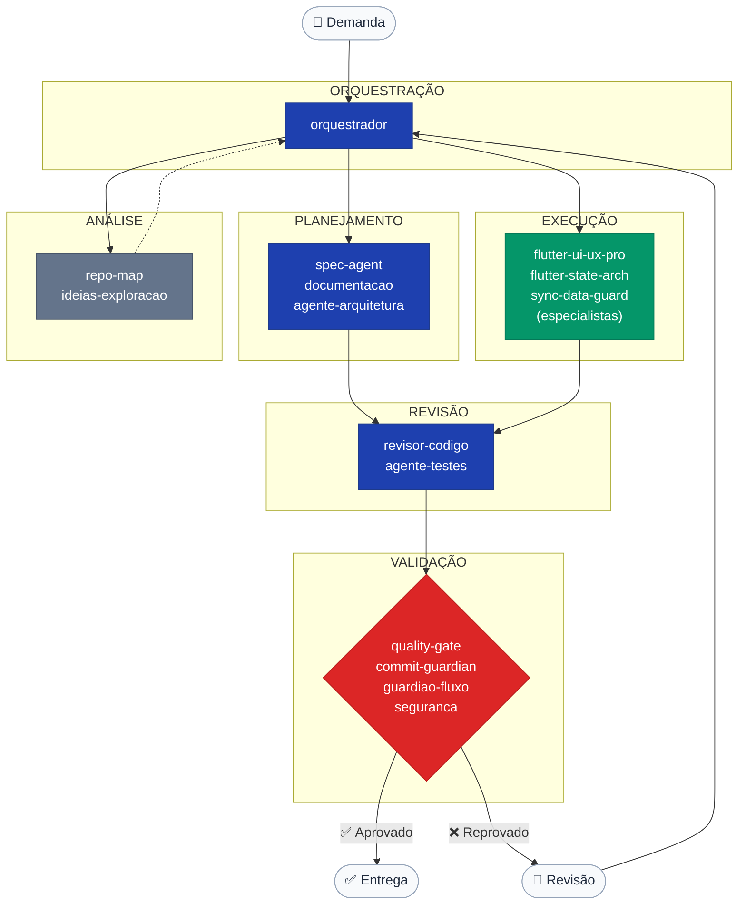

# modelos/agentes/

> Biblioteca de definições de agentes de IA — entidades com identidade, escopo, regras de comportamento e vínculos com prompts e skills.

---

## Arquitetura em Camadas

```
┌──────────────────────────────────────────────────────────────┐
│ CAMADA 1 — Universal                                         │
│ Qualquer linguagem, stack e tipo de projeto                  │
├──────────────────────────────────────────────────────────────┤
│ CAMADA 2 — Especializado por tecnologia                      │
│ Adiciona regras de stack sem contradizer a Camada 1          │
├──────────────────────────────────────────────────────────────┤
│ CAMADA 3 — Especializado por domínio de negócio              │
│ Adiciona contexto de negócio sobre as camadas anteriores     │
├──────────────────────────────────────────────────────────────┤
│ CAMADA 4 — Específico de projeto                             │
│ Cópias em governance/agents/ do repositório de destino       │
│ NUNCA em modelos/ — é artefato do projeto                    │
└──────────────────────────────────────────────────────────────┘
```

**Regras de extensão:**
1. Agente especializado declara `Herda de: {agente-pai}` no metadado.
2. Especializado adiciona regras — nunca remove regras do universal.
3. Quando uma regra especializada contradiz o universal, o universal prevalece.
4. Links de skills e prompts usam caminhos relativos (`../skills/`, `../prompts/`).

---

## Inventário de Agentes

### Camada 1 — Universais

| Agente | Propósito | Skills vinculadas | Prompt vinculado | Status |
|:---|:---|:---|:---|:---:|
| `orquestrador-agentes` | Pipeline central de triagem e delegação | `documentation-consistency-review` | `orquestrador-agentes` | `active` |
| `revisor-codigo` | Revisão de código — qualidade, segurança, padrões | `documentation-consistency-review`, `security-mobile-review` | `revisor-codigo` | `active` |
| `quality-gate` | Verificação transversal final antes de entrega | `documentation-consistency-review` | `quality-gate` | `active` |
| `spec-agent` | Especificações técnicas, fronteiras e planos | `documentation-consistency-review`, `anti-ai-generic-ui` | `spec-agent` | `active` |
| `documentacao-requisitos` | Manutenção de documentação e requisitos | `documentation-consistency-review` | `documentacao-requisitos` | `active` |
| `commit-guardian` | Validação pré-commit (atomicidade, padrão, segredos) | `documentation-consistency-review` | `commit-guardian` | `active` |
| `guardiao-fluxo` | Proteção de fluxos críticos do sistema | `navigation-flow-review`, `offline-sync-review` | `guardiao-fluxo` | `active` |
| `seguranca-conformidade` | Segurança, privacidade e conformidade regulatória | `security-mobile-review`, `forms-validation-review`, `flutter-api-integration` | `seguranca-conformidade` | `active` |
| `repo-map-analyst` | Mapeamento de estrutura de repositório | `documentation-consistency-review` | `repo-map-analyst` | `active` |
| `bootstrap-governanca` | Inicialização de governança (Day-0) | `documentation-consistency-review` | `bootstrap-governanca` | `active` |
| `agente-configuracao-governanca` | Edição contínua de arquivos de governança | `documentation-consistency-review` | `bootstrap-governanca` | `active` |
| `agente-testes` | Estratégia de testes, cobertura e critérios de aceite | `documentation-consistency-review` | `agente-testes` | `active` |
| `agente-arquitetura` | ADRs, proteção de fronteiras e dívida técnica | `documentation-consistency-review` | `agente-arquitetura` | `active` |
| `agente-api-contratos` | Definição, versionamento e conformidade de APIs | `documentation-consistency-review`, `flutter-api-integration` | `agente-api-contratos` | `active` |
| `agente-ci-cd` | Pipeline de integração e entrega contínua (CI/CD) | `documentation-consistency-review`, `security-mobile-review` | `agente-ci-cd` | `active` |
| `agente-performance` | Otimização de performance, consumo de recursos e latência | `code-review-universal`, `performance-universal` | — | `active` |
| `ideias-exploracao` | Discovery, exploração técnica e análise de alternativas | — | `ideias-exploracao` | `active` |

### Camada 2 — Flutter

| Agente | Propósito | Herda de | Skills vinculadas | Status |
|:---|:---|:---|:---|:---:|
| `flutter-revisor-codigo` | Revisão de código Dart/Flutter sênior | `revisor-codigo` | `code-review-universal`, `flutter-code-review`, `documentation-consistency-review`, `security-mobile-review`, `flutter-analyze-lint` | `active` |
| `flutter-quality-gate` | Gate final de qualidade e análise estática Flutter | `quality-gate` | `documentation-consistency-review`, `flutter-analyze-lint` | `active` |
| `flutter-ui-ux-pro` | UI/UX em Flutter — responsividade, tema, acessibilidade | `(agente-ui-ux-universal)` | `ui-ux-pro-review`, `anti-ai-generic-ui`, `flutter-ui-standards` | `active` |
| `flutter-state-arch` | Arquitetura de estado Flutter — GetX, Riverpod, BLoC, Provider | `agente-arquitetura` | `flutter-state-review`, `flutter-code-review`, `flutter-performance-guard` | `active` |
| `sync-data-guard` | Sincronização offline/online e integridade SQLite | `guardiao-fluxo` | `offline-sync-review`, `sqlite-integrity-review`, `flutter-sqlite-review` | `active` |

### Depreciados

| Agente | Motivo | Substituto |
|:---|:---|:---|
| `design-ui-ux-pro` | 80% de sobreposição com `flutter-ui-ux-pro` | `flutter-ui-ux-pro` |

### Template base

| Arquivo | Descrição |
|:---|:---|
| `AGENTE_UNIVERSAL.template.md` | Template para criação de novos agentes |

---

## Metadado Obrigatório

Todo agente deve conter o seguinte bloco no início do arquivo:

```markdown
| Campo | Valor |
|:---|:---|
| **Versão** | `X.Y.Z` |
| **Camada** | `Universal` / `Flutter` / `{Tecnologia}` / `Projeto` |
| **Herda de** | `{agente-pai}` ou `—` |
| **Status** | `active` / `draft` / `deprecated` / `archived` |
| **Domínio** | `Geral` / `Flutter` / `Backend` / ... |
| **Atualizado em** | `AAAA-MM-DD` |
```

---

## Fluxo de Orquestração



---

## Governance

### Lifecycle de agentes

```
[draft] → [active] → [maintenance] → [deprecated] → [archived]
```

| Status | Significado | Edição permitida |
|:---|:---|:---|
| `draft` | Em construção | Livre |
| `active` | Uso recomendado | Somente via PR com review |
| `maintenance` | Apenas correções críticas | Somente PATCH |
| `deprecated` | Substituído — não usar em novos projetos | Somente leitura |
| `archived` | Inativo — preservado em `_deprecated/` | Somente leitura |

### Versionamento semântico

| Incremento | Quando |
|:---|:---|
| `PATCH` (X.Y.**Z**) | Ajuste de texto, correção de regra |
| `MINOR` (X.**Y**.Z) | Adição de skill, regra ou seção sem quebrar compatibilidade |
| `MAJOR` (**X**.Y.Z) | Mudança de escopo, remoção de regra, mudança de identidade |

### Naming convention

| Camada | Padrão |
|:---|:---|
| Universal | `{funcao}` sem prefixo de tecnologia |
| Tecnologia (Camada 2) | `{tecnologia}-{funcao}` |
| Domínio (Camada 3) | `{dominio}-{funcao}` |
| Template | `{NOME}.template.md` em MAIÚSCULAS |
| Depreciado | Arquivo com aviso de deprecação, git history preservado |

### Critérios de depreciação

- Sem uso confirmado por 6 meses + existe substituto ativo.
- Conteúdo foi absorvido por agente mais abrangente.
- Tecnologia-alvo foi descontinuada.

---

## Matriz Agente × Skill × Prompt

| Agente | Skill 1 | Skill 2 | Skill 3 | Prompt |
|:---|:---|:---|:---|:---|
| `orquestrador-agentes` | doc-consistency | — | — | orquestrador-agentes |
| `revisor-codigo` | doc-consistency | security-mobile | code-review-universal | revisor-codigo |
| `quality-gate` | doc-consistency | — | — | quality-gate |
| `spec-agent` | doc-consistency | anti-ai-generic-ui | — | spec-agent |
| `documentacao-requisitos` | doc-consistency | — | — | documentacao-requisitos |
| `commit-guardian` | doc-consistency | — | — | commit-guardian |
| `guardiao-fluxo` | navigation-flow | offline-sync | — | guardiao-fluxo |
| `seguranca-conformidade` | security-mobile | forms-validation | flutter-api | seguranca-conformidade |
| `repo-map-analyst` | doc-consistency | — | — | repo-map-analyst |
| `agente-testes` | doc-consistency | — | — | agente-testes |
| `agente-arquitetura` | doc-consistency | — | — | agente-arquitetura |
| `agente-api-contratos` | doc-consistency | flutter-api | — | agente-api-contratos |
| `agente-ci-cd` | doc-consistency | security-mobile | — | agente-ci-cd |
| `agente-performance` | code-review-universal | performance-universal | — | — |
| `flutter-revisor-codigo` | code-review-universal | flutter-code | flutter-analyze-lint | revisor-codigo |
| `flutter-quality-gate` | doc-consistency | flutter-analyze-lint | — | quality-gate |
| `flutter-ui-ux-pro` | ui-ux-pro | anti-ai-generic-ui | flutter-ui-standards | design-ui-ux-pro |
| `flutter-state-arch` | flutter-state | flutter-code | flutter-perf | flutter-state-arch |
| `sync-data-guard` | offline-sync | sqlite-integrity | flutter-sqlite | — |

---

## Como Usar um Agente

1. **Identifique o agente correto** na tabela acima para o tipo de tarefa.
2. **Leia o arquivo completo** — identidade, contexto, regras e vínculos.
3. **Avalie o escopo** — o agente é genérico o suficiente? Ou precisa de adaptação para o projeto?
4. **Copie para o projeto** — coloque em `governance/agents/` do repositório destino.
5. **Preencha o contexto** — substitua `{{PLACEHOLDERS}}` pelas especificidades do projeto.
6. **Vincule prompts e skills** — atualize as seções de skills e prompts com os caminhos corretos.
7. **Não modifique o original** em `modelos/agentes/` — edite apenas a cópia no projeto.

### Agentes mais reutilizáveis (mínima adaptação)

`revisor-codigo` · `commit-guardian` · `spec-agent` · `quality-gate` · `repo-map-analyst` · `ideias-exploracao` · `agente-testes`

### Agentes que requerem adaptação substancial

`orquestrador-agentes` · `guardiao-fluxo` · `agente-arquitetura` · `flutter-ui-ux-pro` · `sync-data-guard`

---

## Relação com Prompts e Skills

```
Agente
  │
  ├─► usa Prompts   → instruções de como executar tarefas específicas
  └─► usa Skills    → capacidades técnicas que ampliam o escopo de atuação
```

> Consulte [`../prompts/README.md`](../prompts/README.md) e [`../skills/README.md`](../skills/README.md).
