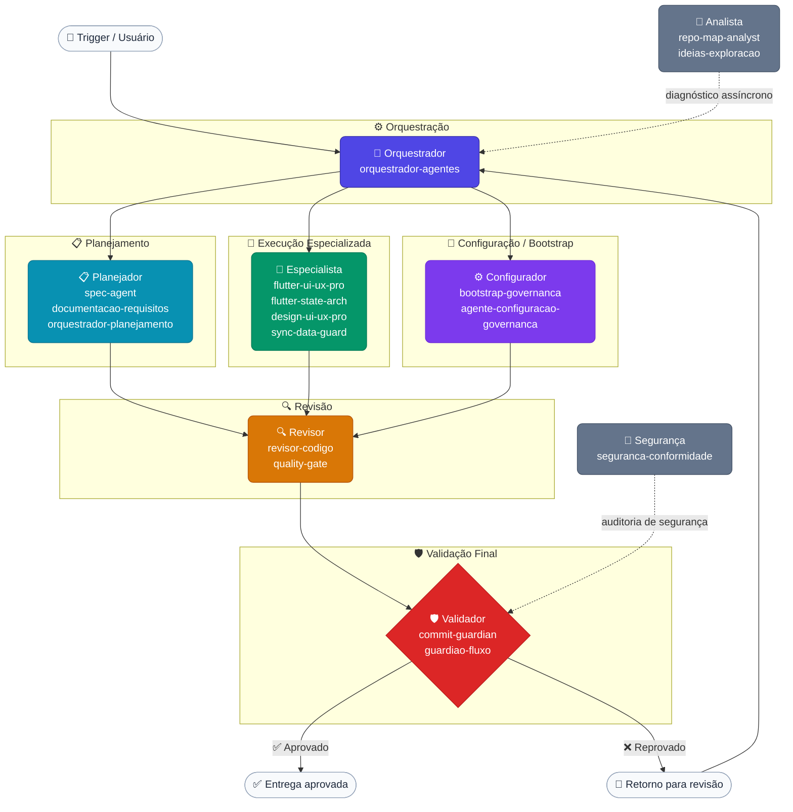

# modelos/agentes/

> Biblioteca de definições de agentes de IA — entidades com identidade, escopo, regras de comportamento e vínculos com prompts e skills.

---

## O que são Agentes

Um agente é uma **entidade de IA com papel definido**. Ao contrário de um prompt genérico, um agente possui:

- **Identidade**: nome, papel e objetivo principal.
- **Contexto**: conhecimento do domínio em que atua.
- **Regras de comportamento**: o que fazer, o que nunca fazer e como responder.
- **Vínculos**: quais prompts e skills ele utiliza para ampliar sua atuação.

Agentes são usados pelas ferramentas de IA (Antigravity, Codex, Continue, etc.) para orientar o comportamento do modelo durante uma sessão ou tarefa específica.

---

## Tipos de Agentes

### Orquestradores
Coordenam o fluxo de trabalho entre outros agentes. Definem a sequência de ações, delegam tarefas, validam pré-condições e consolidam resultados. São o ponto de entrada para pipelines complexos.

**Exemplos nesta pasta:** `orquestrador-agentes.md`

### Revisores
Atuam após a geração de código ou documentação. Verificam qualidade, conformidade com padrões, segurança e cobertura de testes. Geralmente invocados ao final de um ciclo.

**Exemplos nesta pasta:** `revisor-codigo.md`, `quality-gate.md`

### Planejadores
Auxiliam na definição de requisitos, escopo, arquitetura e estratégia antes da implementação. Produzem especificações e planos de ação.

**Exemplos nesta pasta:** `spec-agent.md`, `documentacao-requisitos.md`

### Validadores / Guardiões
Verificam pré e pós-condições em momentos críticos do fluxo — antes de um commit, antes de uma entrega, ou após uma mudança de arquitetura. Bloqueiam ações indesejadas.

**Exemplos nesta pasta:** `commit-guardian.md`, `guardiao-fluxo.md`, `seguranca-conformidade.md`

### Especialistas de Domínio
Possuem conhecimento técnico aprofundado em uma tecnologia ou domínio específico. Atuam em tarefas especializadas que exigem precisão contextual.

**Exemplos nesta pasta:** `flutter-ui-ux-pro.md`, `flutter-state-arch.md`, `sync-data-guard.md`, `design-ui-ux-pro.md`

### Configuradores / Bootstrap
Responsáveis por inicializar projetos com governança, estrutura e padrões desde o primeiro commit. Atuam uma única vez ou em marcos de configuração.

**Exemplos nesta pasta:** `agente-configuracao-governanca.md`, `bootstrap-governanca.md`

### Analistas
Processam repositórios, relatórios ou bases de código para gerar diagnósticos, mapas e inventários. Produzem outputs estruturados para uso posterior.

**Exemplos nesta pasta:** `repo-map-analyst.md`, `ideias-exploracao.md`

---

## Lista de Agentes por Categoria

### 🎯 Orquestradores
| Arquivo | Descrição |
|---|---|
| `orquestrador-agentes.md` | Pipeline central de coordenação de agentes; define sequência e delegação |

### 🔍 Revisores
| Arquivo | Descrição |
|---|---|
| `revisor-codigo.md` | Revisão de código com foco em qualidade, padrões e boas práticas |
| `quality-gate.md` | Gate de qualidade — bloqueia entregas que não atendem critérios mínimos |

### 📋 Planejadores
| Arquivo | Descrição |
|---|---|
| `spec-agent.md` | Geração de especificações técnicas a partir de requisitos |
| `documentacao-requisitos.md` | Levantamento e estruturação de requisitos funcionais e não-funcionais |

### 🛡️ Validadores / Guardiões
| Arquivo | Descrição |
|---|---|
| `commit-guardian.md` | Verifica pré-condições antes de cada commit |
| `guardiao-fluxo.md` | Protege o fluxo de trabalho contra desvios arquiteturais |
| `seguranca-conformidade.md` | Auditoria de segurança e conformidade regulatória |
| `sync-data-guard.md` | Valida integridade de sincronização offline/online de dados |

### 🔧 Especialistas de Domínio
| Arquivo | Descrição |
|---|---|
| `flutter-ui-ux-pro.md` | Padrões de UI/UX em Flutter com foco em qualidade visual |
| `flutter-state-arch.md` | Arquitetura de estado em Flutter (Riverpod, BLoC, etc.) |
| `design-ui-ux-pro.md` | Design de interfaces com princípios de UX avançados |

### ⚙️ Configuradores / Bootstrap
| Arquivo | Descrição |
|---|---|
| `agente-configuracao-governanca.md` | Configura governança inicial de um novo projeto |
| `bootstrap-governanca.md` | Inicializa estrutura mínima de agentes e prompts num repositório |

### 🔎 Analistas
| Arquivo | Descrição |
|---|---|
| `repo-map-analyst.md` | Mapeia e analisa estrutura de repositórios |
| `ideias-exploracao.md` | Agente de exploração criativa para ideação de features e soluções |

### 📄 Template Base
| Arquivo | Descrição |
|---|---|
| `AGENTE_UNIVERSAL.template.md` | Template universal para criação de novos agentes |

---

## Fluxograma de Atuação



> **Leitura do fluxo:**
> - O **Orquestrador** é o único ponto de entrada — ele distribui o trabalho.
> - **Planejadores**, **Especialistas** e **Configuradores** atuam em paralelo conforme o tipo de tarefa.
> - O **Revisor** consolida as saídas antes da validação final.
> - O **Validador** é o guardião da entrega — reprova e devolve ao Orquestrador se os critérios não forem atendidos.
> - **Analistas** e **Segurança** operam de forma assíncrona, alimentando o ciclo sem bloqueá-lo.

---

## Como Reutilizar um Agente

1. **Leia o arquivo completo** — entenda a identidade, contexto, regras e vínculos do agente.
2. **Avalie o escopo** — o agente é genérico o suficiente para sua necessidade? Ou precisa de adaptação?
3. **Copie para o projeto** — coloque em `governance/agents/` ou caminho equivalente do repositório destino.
4. **Adapte o contexto** — substitua referências genéricas pelas especificidades do projeto.
5. **Vincule prompts e skills** — atualize as seções `## Skills Ativas` e `## Prompts de Referência`.
6. **Não modifique o original** em `modelos/agentes/` — edite apenas a cópia.

### Agentes mais genéricos (menor adaptação necessária)
`revisor-codigo.md`, `commit-guardian.md`, `spec-agent.md`, `quality-gate.md`, `repo-map-analyst.md`

### Agentes mais específicos (requerem adaptação substancial)
`flutter-ui-ux-pro.md`, `sync-data-guard.md`, `agente-configuracao-governanca.md`

---

## Critérios de Manutenção

- Um agente deve ser atualizado quando suas **regras ficarem desatualizadas** em relação ao projeto que o originou.
- Agentes obsoletos vão para `_deprecated/` — nunca são deletados diretamente.
- Agentes duplicados com pequenas variações devem ser consolidados em um único agente parametrizável.
- Toda atualização de agente deve ser versionada via `git commit` com mensagem descritiva.

---

## Relação com Prompts e Skills

```
Agente
  │
  ├─► usa Prompts   → instruções de como executar tarefas específicas
  └─► usa Skills    → capacidades técnicas que ampliam o escopo de atuação
```

Um agente **orquestra** o uso de prompts e skills — ele define o contexto e as regras, enquanto prompts e skills fornecem a execução especializada.

> Consulte [`prompts/README.md`](../prompts/README.md) e [`skills/README.md`](../skills/README.md) para entender os artefatos disponíveis.
