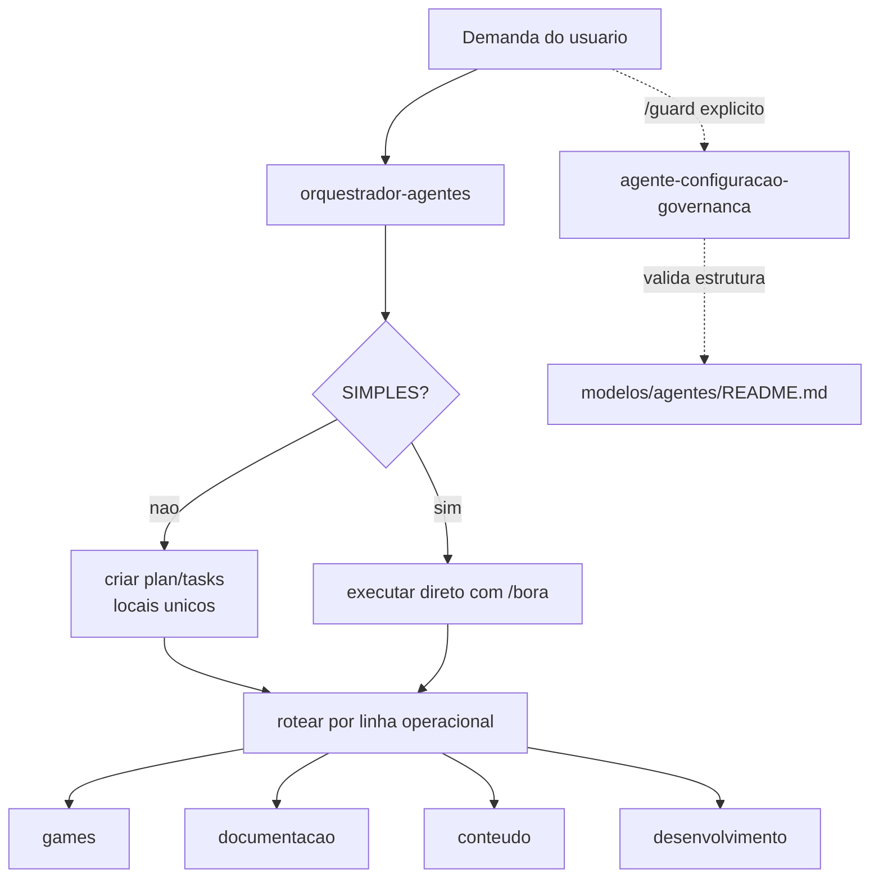
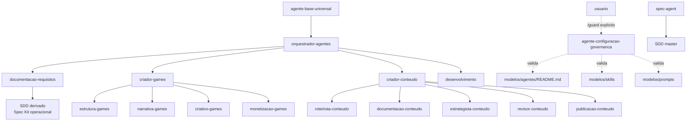
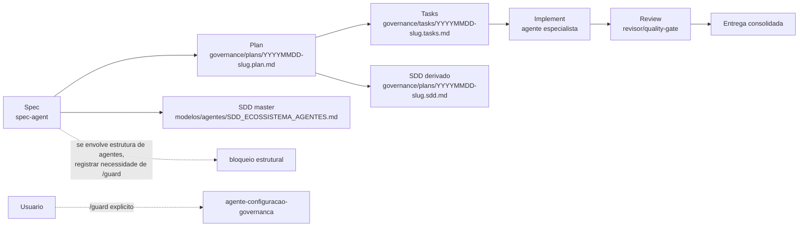
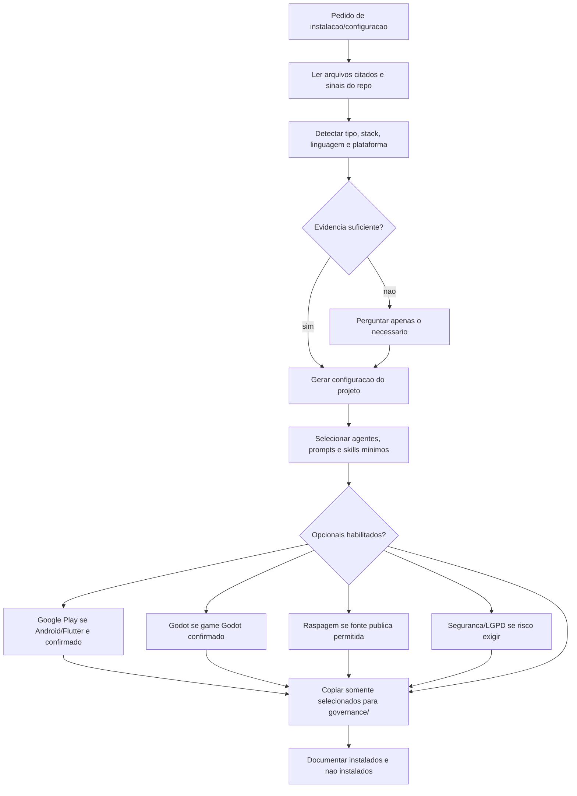

# Software Design Document - Ecossistema de Agentes

| Campo | Valor |
|:---|:---|
| **Tipo do projeto** | `GOVERNANCA_DE_IA` |
| **Versao do documento** | `1.2.0` |
| **Status** | `EM ANALISE` |
| **Data** | `2026-06-04` |
| **Autores** | `spec-agent` |
| **Revisores** | `agente-configuracao-governanca`, `documentacao-requisitos`, `quality-gate`, humano responsavel |

---

## 1. Introducao

### 1.1 Proposito

Este SDD formaliza o ecossistema de agentes mantido em `modelos/agentes`. Ele define responsabilidades, limites, heranca, permissoes, skills, tags, orquestracao e integracao com o fluxo GitHub Spec Kit.

O ecossistema existe para padronizar agentes reutilizaveis sem misturar coordenacao, edicao de configuracao, documentacao e especificacao. O problema central resolvido e evitar agentes redundantes, grandes demais, com autoridade implicita ou com escopo ambiguo.

O guardiao e separado do orquestrador porque coordenar execucao e editar configuracao sao responsabilidades incompativeis: o orquestrador escolhe o caminho; o guardiao protege a estrutura, as permissoes e a configuracao padrao. O guardiao nunca e acionado automaticamente pelo orquestrador; ele so atua por pedido explicito do usuario via `/guard`.

### 1.2 Escopo

**Dentro do escopo:**
- Definicao formal dos agentes em `modelos/agentes`.
- Regras de autoridade, tags, permissoes, proibicoes e validacao.
- Mapeamento de skills e prompts vinculados.
- Fluxo de orquestracao, fluxo de edicao de configuracao, padrao unico de `plan`/`tasks` e fluxo Spec Kit.
- Proposta de atualizacao do `modelos/agentes/README.md`.

**Fora do escopo:**
- Implementacao de codigo de produto.
- Copia de dados de projetos privados para a camada universal.
- Criacao de branch, commit ou push.
- Edicao de configuracoes de ferramentas fora do escopo do guardiao.

### 1.3 Glossario

| Termo | Definicao |
|:---|:---|
| Agente | Definicao versionada de responsabilidade, limites, skills e prompt. |
| Orquestrador pai | Agente que classifica a demanda, decide ordem de execucao e faz handoff. |
| Guardiao de agentes | Agente com autoridade exclusiva para criar, alterar, remover, validar e reorganizar agentes. |
| SDD | Software Design Document; especificacao tecnica formal do sistema. |
| Spec Kit | Fluxo `Spec -> Plan -> Tasks -> Implement` com artefatos Markdown rastreaveis. |
| Skill | Capacidade tecnica modular associada a um agente. |
| Prompt | Instrucao operacional vinculada ao agente. |
| Handoff | Transferencia explicita de responsabilidade entre agentes. |

### 1.4 Referencias

- `modelos/docs/SDD_UNIVERSAL.template.md`
- `modelos/agentes/README.md`
- `modelos/skills/README.md`
- `modelos/prompts/README.md`
- GitHub Spec Kit: fluxo `Spec -> Plan -> Tasks -> Implement`

---

## 2. Visao Geral do Sistema

O sistema e uma biblioteca de agentes reutilizaveis em camadas. A camada universal define regras comuns. A camada tecnologica adiciona especializacao por stack. A camada funcional ou de dominio adiciona orquestradores e especialistas por area. A camada de projeto recebe copias adaptadas, nunca substitui a camada universal.

**Usuarios primarios:** mantenedor do workspace, agentes de IA, revisores humanos e projetos que reutilizam os modelos.

**Restricoes de ambiente:** Markdown versionado, caminhos relativos para skills/prompts, compatibilidade entre Antigravity Codex e Open Code, sem dependencia de recurso exclusivo de plataforma.

### 2.1 Cadeia de autoridade

| Nivel | Papel | Autoridade |
|:---|:---|:---|
| 1 | Humano responsavel | Aprova direcao, excecoes e mudancas sensiveis. |
| 2 | `agente-configuracao-governanca` | Edita e valida agentes, regras, permissoes, prompts, skills e mapas de governanca. |
| 3 | `orquestrador-agentes` | Coordena, classifica, executa demandas simples e cria `plan`/`tasks` para demandas complexas; nao edita configuracao. |
| 3.5 | `conselho-decisao` | Coordena Conselho de Decisão; produz pareceres de crítica multi-perspectiva; não edita governança. |
| 4 | Agentes especializados | Executam tarefas dentro do escopo declarado. |
| 5 | Skills e prompts | Fornecem criterios e instrucoes; nao tem autoridade propria. |

### 2.2 Fluxo de decisao

1. Receber a intencao do usuario.
2. Classificar escopo: agentes, documentacao, SDD, coordenacao, dominio ou tecnologia.
3. Se a demanda for simples, executar diretamente com `/bora`.
4. Se a demanda for complexa, criar `plan` em `governance/plans/` e `tasks` em `governance/tasks/`.
5. Se a demanda exigir crítica multi-perspectiva, acionar `conselho-decisao` via `/conselho` para parecer.
6. Encaminhar para uma das quatro linhas operacionais: games, documentacao, conteudo ou desenvolvimento.
7. Se houver mudanca estrutural, registrar que o usuario precisa acionar `/guard`; nao chamar o guardiao automaticamente.
7. Consolidar resultado, riscos e proximos passos.

### 2.3 Fluxo de execucao

---

## 3. Arquitetura do Sistema

### 3.1 Diagrama de componentes

### 3.2 Componentes

| Componente | Responsabilidade | Tecnologia |
|:---|:---|:---|
| Agentes | Identidade, escopo, limites, permissao e relacoes | Markdown |
| Skills | Capacidades modulares de validacao e execucao | Markdown |
| Prompts | Instrucoes operacionais por tarefa | Markdown |
| README de agentes | Inventario, matriz, fluxos e governanca | Markdown + Mermaid |
| SDD | Especificacao formal do ecossistema | Markdown + Mermaid |

### 3.3 Fluxo de dados

Nao ha banco de dados ou API. O fluxo e documental: demandas entram pelo orquestrador, sao classificadas, viram execucao direta ou artefatos Markdown padronizados, e mudancas estruturais so seguem para o guardiao quando o usuario aciona `/guard`. `plan` fica em `governance/plans/`; `tasks` fica em `governance/tasks/`.

---

## 4. Design Detalhado

### 4.1 Organizacao dos agentes

| Camada | Regra | Exemplos |
|:---|:---|:---|
| Universal (Camada 1) | Base reutilizável; não depende de stack ou projeto | `agente-base-universal`, `orquestrador-agentes`, `spec-agent` |
| Tecnologia (Camada 2) | Especializa regra universal por stack/plataforma técnica | `flutter-revisor-codigo`, `google-play-support` |
| Funcional / Domínio (Camada 3) | Orquestra ou executa lógica e mecânicas de um domínio de negócio | `criador-games`, `criador-conteudo` |
| Projeto (Camada 4) | Cópia adaptada em repositório destino | `governance/agents/` |

#### Distinção Arquitetural de Abstração (Camada 2 vs. Camada 3)

A linha divisória entre a Camada 2 (Tecnologia/Plataforma) e a Camada 3 (Domínio Funcional) é estrutural:

- **Abstração Tecnológica (Camada 2):** Responde a restrições de sintaxe, linting, compilação, ciclo de vida e APIs de plataformas específicas. Por exemplo, a stack **Flutter** é uma camada técnica. Os agentes especializados em Flutter validam a integridade e boas práticas do framework Dart/Flutter, sendo completamente horizontais e reutilizáveis em qualquer tipo de negócio (seja para um banco ou para um jogo).
- **Abstração de Domínio (Camada 3):** Responde a regras de negócios, modelagens conceituais, roteirização, gameplay e fluxos lógicos que independem de stack tecnológica. Por exemplo, o design de **Games** e a criação de **Conteúdo Editorial** representam a Camada 3. O core loop de um jogo, o balanceamento de atributos ou a estrutura narrativa de um roteiro funcionam da mesma forma se o jogo for codificado em Flutter (Camada 2), Godot/GDScript (Camada 2) ou Unity/C#.

### 4.1.1 Padrao unico de artefatos operacionais

| Artefato | Local unico | Nome padrao | Observacao |
|:---|:---|:---|:---|
| Plan | `governance/plans/` | `YYYYMMDD-slug.plan.md` | Criado pelo orquestrador para demanda complexa |
| Tasks | `governance/tasks/` | `YYYYMMDD-slug.tasks.md` | Criado pelo orquestrador para demanda complexa |
| SDD master | `modelos/agentes/SDD_ECOSSISTEMA_AGENTES.md` | Fixo | Nao e substituido por SDD derivado |
| SDD derivado | `governance/plans/` | `YYYYMMDD-slug.sdd.md` | Existe apenas para o escopo do plano |

### 4.1.2 Estrutura fisica de pastas

| Caminho | Funcao | Pode conter | Nao pode conter |
|:---|:---|:---|:---|
| `modelos/agentes/` | Biblioteca mestre de agentes reutilizaveis | Agentes universais, tecnologicos, funcionais, SDD master e README da biblioteca | Configuracao especifica de projeto ou copias adaptadas |
| `modelos/skills/` | Biblioteca mestre de skills | Skills versionadas e reutilizaveis | Regras privadas de projeto |
| `modelos/prompts/` | Biblioteca mestre de prompts | Prompts vinculados a agentes | Prompts especificos de projeto sem generalizacao |
| `governance/agents/` | Camada de projeto | Copias adaptadas de agentes para o repositorio destino | Modelos universais originais |
| `governance/plans/` | Planos e SDDs derivados | `YYYYMMDD-slug.plan.md` e `YYYYMMDD-slug.sdd.md` | Tasks soltas ou documentos sem vinculo com plano |
| `governance/tasks/` | Tarefas derivadas de planos | `YYYYMMDD-slug.tasks.md` | Plans, SDD master ou agentes |
| Documentacao operacional do projeto | Guias, checklists e evidencias do projeto destino | README, guias, evidencias de publicacao, documentos Google Play | Governanca estrutural de agentes |

Conteudo especifico de projeto nao deve ser gravado em `modelos/`. Quando um modelo universal precisar ser aplicado em um projeto, a copia adaptada deve ir para `governance/`.

### 4.2 Padroes e convencoes

- **Nomenclatura:** nomes em kebab-case; especializacao por tecnologia usa prefixo tecnologico; dominio usa prefixo ou sufixo funcional claro.
- **Heranca:** todo agente declara `Herda de`; `-` e permitido apenas para agentes universais-raiz.
- **Prompts e skills:** sempre usar caminhos relativos `../prompts/` e `../skills/`.
- **Status:** `draft`, `active`, `maintenance`, `deprecated`, `archived`.
- **Versionamento:** SemVer; MAJOR para mudanca de identidade/escopo, MINOR para nova regra/skill, PATCH para ajuste textual.

### 4.3 Regras por agente

| Agente | Responsabilidade principal | Entradas | Saidas | Pode alterar | Jamais pode alterar | Limites e relacoes |
|:---|:---|:---|:---|:---|:---|:---|
| `agente-base-universal` | Base herdavel de escopo e governanca minima | Definicao de agente, README | Diagnostico de aderencia | Nenhum arquivo por execucao direta | Agentes, prompts, skills, codigo, configuracoes | Referencia universal validada pelo guardiao |
| `orquestrador-agentes` | Classificar demanda, executar simples, criar `plan`/`tasks` para complexas e fazer handoff | Pedido do usuario, tags, contexto | Execucao direta, plan/tasks, roteamento, consolidacao | `governance/plans/*.plan.md`, `governance/tasks/*.tasks.md` | Agentes, prompts, skills, permissoes, hierarquia | Nao aciona guardiao automaticamente; apenas informa necessidade de `/guard` |
| `agente-configuracao-governanca` | Guardiao oficial de agentes e governanca estrutural | Pedido explicito `/guard`, diff, agentes, README | Mudanca validada ou bloqueio | `modelos/agentes/`, `governance/agents/`, `governance/prompts/`, `governance/skills/`, mapas e configs de IA | Codigo de produto e docs nao relacionados | Atualiza README em toda mudanca estrutural |
| `documentacao-requisitos` | Coordenar a frente documental, `/limpadoc`, SDD derivado, Spec Kit operacional e fluxo documental Google Play | README, guias, plans, tasks, artefatos, demandas Play Console | Docs atualizadas, pendencias consolidadas, SDD derivado, documentacao Google Play | README, guias, SDD derivado, docs operacionais, documentos Google Play | Agentes, prompts, skills, permissoes, hierarquia | Aciona `google-play-support` como especialista subordinado quando o assunto for Google Play |
| `spec-agent` | SDD master, SDD derivado e validacao Spec Kit | Intencao, requisitos, restricoes, plano | SDD master, SDD derivado, validation, boundaries | Artefatos Spec Kit e SDDs definidos pelo projeto | Configuracao de agentes sem `/guard` | Usa `Spec -> Plan -> Tasks -> Implement`; SDD derivado nao substitui master |
| `quality-gate` | Validacao transversal de entrega | Spec, plano, tasks, docs, evidencias | Aprovado/reprovado, riscos | Relatorios de validacao | Configuracao de agentes | Valida entrega, nao substitui guardiao |
| `revisor-codigo` | Revisao de codigo e qualidade tecnica | Diff, arquivos de codigo, criterios | Achados, riscos, recomendacoes | Relatorio/revisao; codigo apenas se autorizado pela tarefa | Governanca de agentes | Atua antes de quality gate |
| `commit-guardian` | Validacao pre-commit | Diff, testes, docs | Status de commit, mensagem sugerida | Relatorio de readiness | Branches, commits ou configs sem pedido explicito | Nao cria commit sem autorizacao |
| `guardiao-fluxo` | Protecao de fluxos criticos | Fluxos, navegacao, sincronizacao | Bloqueios e riscos de fluxo | Relatorios de auditoria | Agentes e governanca estrutural | Complementa arquitetura e seguranca |
| `seguranca-conformidade` | Seguranca, privacidade e conformidade | Codigo, permissoes, dados, APIs | Achados e bloqueios de seguranca | Relatorios e ajustes autorizados | Configuracao de agentes | Alimenta quality gate |
| `repo-map-analyst` | Mapeamento estrutural do repositorio | Arvore, README, configs | Mapa, riscos e lacunas | Relatorios de mapa | Mudancas estruturais sem autorizacao | Subsidia orquestrador |
| `bootstrap-governanca` | Inicializacao Day-0 de governanca | README, contexto, templates | Estrutura inicial de governanca | Estrutura inicial autorizada | Mudanca continua sem `/guard` explicito | Depois do Day-0 exige `/guard` para continuidade estrutural |
| `agente-testes` | Estrategia de testes e criterios de aceite | Spec, codigo, tasks | Plano e lacunas de teste | Artefatos de teste/documentacao | Configuracao de agentes | Alimenta quality gate |
| `agente-arquitetura` | ADRs, fronteiras e divida tecnica | Requisitos, codigo, arquitetura | ADRs, decisoes, riscos | Artefatos arquiteturais | Governanca de agentes | Base para especialistas estruturais |
| `agente-api-contratos` | Contratos, versionamento e conformidade de APIs | Specs de API, payloads, erros | Contratos, riscos, validacoes | Docs de API e specs autorizadas | Agentes e configs | Complementa seguranca e integracao |
| `agente-ci-cd` | Pipeline CI/CD e automacao | Workflows, testes, release | Plano/ajustes de pipeline | Arquivos CI/CD quando autorizado | Agentes e prompts | Deve aplicar minimo privilegio |
| `agente-performance` | Performance, consumo e latencia | Codigo, metricas, queries | Diagnostico e recomendacoes | Relatorios ou ajustes autorizados | Governanca de agentes | Usa skills de performance e revisao |
| `marketing-sistemas` | Posicionamento e copy de sistemas | Produto, publico, features | Copy, campanha, proposta de valor | Artefatos de marketing | Governanca de agentes | Base do `estrategista-conteudo` |
| `validador-documentacao` | Lint e conformidade documental | Markdown, templates, links | Aprovado/reprovado, correcoes | Docs quando autorizado | Configuracao de agentes | Valida docs e agentes por template, sem editar governanca |
| `distribuidor-aplicativos` | Readiness de release e distribuicao | Build, assets, privacidade | Checklist de release | Docs/checklists de release | Configuracao de agentes | Base do `google-play-support` |
| `ideias-exploracao` | Discovery e analise de alternativas | Problema, restricoes, hipoteses | Opcoes, tradeoffs, recomendacoes | Artefatos de ideacao | Governanca de agentes | Nao implementa por si so |
| `conselho-decisao` | Orquestrador do Conselho de Decisao | Demanda de critica (SDD, decisao, feature, testes) | Parecer consolidado com perspectivas multiplas | `governance/plans/YYYYMMDD-slug.parecer.md` | Agentes, prompts, skills, governanca estrutural | Acionado via `/conselho` ou handoff do `orquestrador-agentes` |
| `caminho-correto` | Conselheiro de validacao de conformidade | SDD ou decisao para revisar | Parecer de conformidade | Nenhum arquivo | Governanca estrutural | Acionado pelo `conselho-decisao` |
| `caca-falhas` | Conselheiro de busca ativa de falhas | SDD, decisao ou feature para analisar | Parecer de riscos e casos de teste | Nenhum arquivo | Governanca estrutural | Acionado pelo `conselho-decisao` |
| `fora-da-caixa` | Conselheiro de alternativas criativas | Feature ou decisao para expandir | Parecer com alternativas e expansoes | Nenhum arquivo | Governanca estrutural | Acionado pelo `conselho-decisao` |
| `leigo-radical` | Conselheiro de questionamento radical | Qualquer demanda para simplificar | Parecer com questionamentos e simplificacoes | Nenhum arquivo | Governanca estrutural | Acionado pelo `conselho-decisao` |
| `flutter-revisor-codigo` | Revisao Dart/Flutter | Codigo Flutter, lint, UI | Achados Flutter | Codigo Flutter se autorizado | Governanca de agentes | Herda `revisor-codigo` |
| `flutter-quality-gate` | Gate final Flutter | Testes, analyze, docs | Status final Flutter | Relatorios de validacao | Governanca de agentes | Herda `quality-gate` |
| `flutter-ui-ux-pro` | UI/UX Flutter | Telas, temas, widgets | Auditoria e ajustes UI autorizados | Codigo/UI Flutter se autorizado | Agentes e configs | Herda `agente-base-universal` |
| `flutter-state-arch` | Estado Flutter | Providers, BLoC, GetX, Riverpod | Riscos de estado, plano | Codigo de estado se autorizado | Governanca de agentes | Especializacao de arquitetura Flutter |
| `sync-data-guard` | Sincronizacao offline/online | Fluxos, SQLite, filas | Riscos de sync e integridade | Codigo/dados se autorizado | Governanca de agentes | Herda `guardiao-fluxo` |
| `google-play-support` | Especialista tecnico-documental de Google Play subordinado a `documentacao-requisitos` | Manifest, politicas, assets, store listing, evidencias de release | Checklist tecnico, riscos de loja, evidencias praticas e insumos documentais | Docs/assets de publicacao e consultas de terminal dentro do escopo | Governanca de agentes, coordenacao documental e publicacao externa | Atua sob a frente documental; pode usar terminal para validacao operacional quando a tarefa exigir |
| `criador-games` | Orquestrador de games e GDD | Ideia de jogo, publico, plataforma | GDD consolidado, delegacao | GDD e artefatos de games | Codigo de gameplay e configs de agentes | Delega especialistas de games |
| `estrutura-games` | Mecanicas, core loop e balanceamento | Regras, numeros, progressao | Sistemas e tabelas de balanceamento | Artefatos de gameplay/design | Narrativa, HUD, governanca | Delegado por `criador-games` |
| `narrativa-games` | Historia, lore e dialogos | Universo, tom, personagens | Roteiros, arcos, dialogos | Artefatos narrativos | Balanceamento, HUD, governanca | Delegado por `criador-games` |
| `criativo-games` | HUD, UX e direcao visual | Estilo, plataforma, gameplay | Guia visual, HUD, UX | Artefatos visuais conceituais | Mecanicas, monetizacao, governanca | Delegado por `criador-games` |
| `monetizacao-games` | Economia, monetizacao e retencao | Modelo de negocio, loop, publico | Economia, pricing, ads | Artefatos de monetizacao | APIs de pagamento, arte, governanca | Delegado por `criador-games` |
| `criador-conteudo` | Orquestrador editorial | Pedido, publico, canal, objetivo | Entrega consolidada e delegacao | Artefatos editoriais solicitados | Governanca estrutural e publicacao externa | Delega familia de conteudo |
| `roteirista-conteudo` | Roteiros e storytelling | Briefing, publico, formato | Roteiro, cenas, beats | Roteiros e pautas | Estrategia ampla, publicacao, governanca | Delegado por `criador-conteudo` |
| `documentacao-conteudo` | Docs editoriais | Briefing, templates, conteudo | README, guias, docs editoriais | Docs editoriais | Agentes, skills, prompts | Delegado por `criador-conteudo` |
| `estrategista-conteudo` | Estrategia editorial | Publico, canal, objetivos | Plano, pauta, CTA | Briefing, pauta, calendario | Roteiro final, publicacao, governanca | Delegado por `criador-conteudo` |
| `revisor-conteudo` | Qualidade editorial | Conteudo pronto, briefing | Correcoes, aprovado/rejeitado | Artefatos em revisao quando autorizado | Estrategia original, publicacao, governanca | Valida familia de conteudo |
| `publicacao-conteudo` | Readiness de publicacao | Canal, conteudo, links, metadados | Checklist de publicacao | Metadados e checklist | Publicacao externa, governanca | Exige aprovacao humana final |
| `design-ui-ux-pro` | Agente depreciado de UI/UX | N/A | Aviso de substituicao | Somente leitura | Qualquer edicao funcional | Substituido por `flutter-ui-ux-pro` |

---

## 5. Regras de Governanca

### 5.1 Quem pode editar agentes

Somente `agente-configuracao-governanca` pode editar agentes, prompts, skills, permissoes, hierarquia, mapas e configuracoes estruturais. Mudancas feitas por qualquer outro agente devem ser tratadas como violacao de governanca.

### 5.2 Quem pode aprovar mudancas

| Mudanca | Aprovador tecnico | Revisao complementar |
|:---|:---|:---|
| Criar/alterar/remover agente | `agente-configuracao-governanca` | Humano responsavel |
| Alterar README de agentes por mudanca estrutural | `agente-configuracao-governanca` | `documentacao-requisitos` |
| Alterar SDD master ou artefatos Spec Kit | `spec-agent` | `quality-gate`; exige `/guard` explicito se afetar agentes |
| Alterar documentacao operacional | `documentacao-requisitos` | `validador-documentacao` |
| Alterar skills ou prompts | `agente-configuracao-governanca` | Agente especialista afetado |

### 5.3 Proibicoes por papel

| Papel | Proibido |
|:---|:---|
| Orquestrador | Editar agentes, prompts, skills, permissoes, hierarquia e configs. |
| Guardiao | Executar implementacao de produto fora de governanca. |
| Documentacao | Alterar regras de agentes; deve registrar a necessidade e orientar `/guard` explicito. |
| SDD | Alterar estrutura de agentes; deve especificar impacto e orientar `/guard` explicito. |
| Especialistas | Invadir escopo de outro especialista ou assumir orquestracao sem declaracao. |

### 5.4 Uso controlado de terminal

Agentes especialistas podem executar comandos de terminal quando a tarefa exigir validacao operacional pratica e o comando estiver dentro do escopo do agente. Essa permissao nao amplia autoridade sobre governanca, agentes, prompts, skills ou hierarquia.

Para `google-play-support`, o uso de terminal e permitido para localizar e inspecionar evidencias de release, como `AndroidManifest.xml`, `build.gradle`, `app/build.gradle.kts`, `pubspec.yaml`, diretorios Android, assets, icones, screenshots, `fastlane`, arquivos `.aab` e `.apk`. O resultado deve alimentar a documentacao coordenada por `documentacao-requisitos`.

---

## 6. Skills dos Agentes

### 6.1 Matriz de skills ativas

| Agente | Skills ativas | Quando acionar | Quando nao acionar |
|:---|:---|:---|:---|
| `agente-base-universal` | `scope-control`, `documentation-consistency-review` | Criacao/revisao de escopo de agente | Execucao de produto |
| `orquestrador-agentes` | `documentation-consistency-review`, `scope-control` | Classificacao, execucao simples, plan/tasks e handoff | Edicao de configuracao |
| `agente-configuracao-governanca` | `documentation-consistency-review` | Pedido explicito `/guard` para mudancas estruturais de agentes | Implementacao fora de governanca |
| `documentacao-requisitos` | `documentation-consistency-review` | README, guias, `/limpadoc`, SDD derivado, documentacao operacional e coordenacao documental Google Play | Governanca estrutural |
| `spec-agent` | `documentation-consistency-review`, `anti-ai-generic-ui` | SDD master, SDD derivado e Spec Kit | Edicao de agentes sem `/guard` explicito |
| `quality-gate` | `documentation-consistency-review` | Validacao final transversal | Criacao de agentes |
| `revisor-codigo` | `code-review-universal`, `documentation-consistency-review`, `security-mobile-review` | Revisao de diff/codigo | Governanca estrutural |
| `commit-guardian` | `documentation-consistency-review` | Readiness de commit | Criar commit sem pedido |
| `guardiao-fluxo` | `navigation-flow-review`, `offline-sync-review` | Fluxos criticos | Agentes/configs |
| `seguranca-conformidade` | `security-mobile-review`, `forms-validation-review`, `flutter-api-integration` | Seguranca e compliance | Design editorial |
| `repo-map-analyst` | `documentation-consistency-review` | Mapeamento de repo | Alteracao estrutural |
| `bootstrap-governanca` | `documentation-consistency-review` | Inicializacao Day-0 | Mudanca continua |
| `agente-testes` | `documentation-consistency-review` | Plano de testes | Governanca estrutural |
| `agente-arquitetura` | `documentation-consistency-review` | ADRs e fronteiras | Edicao de agentes |
| `agente-api-contratos` | `documentation-consistency-review`, `flutter-api-integration` | Contratos/API | UI/marketing |
| `agente-ci-cd` | `documentation-consistency-review`, `security-mobile-review` | Pipeline e workflows | Agentes/configs |
| `agente-performance` | `code-review-universal`, `performance-universal` | Performance e recursos | Conteudo editorial |
| `marketing-sistemas` | `product-positioning`, `audience-segmentation`, `value-proposition-writing`, `launch-campaign-planning`, `conversion-copy-review`, `feature-storytelling` | Marketing de produto | Documentacao tecnica pura |
| `validador-documentacao` | `documentation-consistency`, `template-adherence`, `structure-review`, `markdown-quality`, `placeholder-governance` | Lint/documentacao | Edicao de governanca |
| `distribuidor-aplicativos` | `release-readiness`, `asset-compliance`, `privacy-disclosure-review` | Readiness de release | Agentes/configs |
| `ideias-exploracao` | Nao declarada no agente | Discovery e alternativas | Execucao/edicao estrutural |
| `conselho-decisao` | `decision-critique`, `sdd-review`, `test-derivation`, `feature-expansion` | Coordenacao do conselho, consolidacao de pareceres, handoff | Edicao de agentes/governanca |
| `caminho-correto` | `decision-critique`, `sdd-review` | Validacao de conformidade de SDD e decisoes | Edicao de agentes/governanca |
| `caca-falhas` | `sdd-review`, `test-derivation` | Busca de falhas, riscos e derivacao de testes | Edicao de agentes/governanca |
| `fora-da-caixa` | `decision-critique`, `feature-expansion` | Proposicao de alternativas e expansao de features | Edicao de agentes/governanca |
| `leigo-radical` | `sdd-review`, `test-derivation`, `feature-expansion` | Questionamento de premissas e simplificacao | Edicao de agentes/governanca |
| `flutter-revisor-codigo` | `code-review-universal`, `flutter-code-review`, `documentation-consistency-review`, `security-mobile-review`, `flutter-analyze-lint` | Codigo Flutter | Governanca |
| `flutter-quality-gate` | `documentation-consistency-review`, `flutter-analyze-lint` | Gate Flutter | Criacao de agentes |
| `flutter-ui-ux-pro` | `ui-ux-pro-review`, `anti-ai-generic-ui`, `flutter-ui-standards` | UI/UX Flutter | Economia, narrativa, agentes |
| `flutter-state-arch` | `flutter-state-review`, `flutter-code-review`, `flutter-performance-guard` | Estado Flutter | UI visual pura |
| `sync-data-guard` | `offline-sync-review`, `sqlite-integrity-review`, `flutter-sqlite-review` | Sync/SQLite | Marketing/conteudo |
| `google-play-support` | `play-console-checklist`, `store-listing-optimization`, `android-policy-review`, `asset-compliance`, `release-readiness`, `privacy-disclosure-review` | Google Play sob coordenacao de `documentacao-requisitos`; terminal se houver validacao pratica | Codigo de produto, governanca estrutural ou publicacao externa |
| `criador-games` | `game-loop-design`, `game-structure-planning`, `game-release-readiness`, `scope-control`, `documentation-consistency-review` | GDD e delegacao de games | Especializacao detalhada se houver agente responsavel |
| `estrutura-games` | `game-structure-planning`, `game-loop-design`, `game-mechanics-balance`, `scope-control` | Mecanicas/loop/balanceamento | Narrativa/HUD |
| `narrativa-games` | `game-narrative-design`, `narrative-structure`, `documentation-consistency-review` | Historia/lore/dialogos | Balanceamento/HUD |
| `criativo-games` | `game-ux-ui`, `ui-ux-pro-review`, `scope-control` | HUD/UX/direcao visual | Monetizacao/mecanicas |
| `monetizacao-games` | `game-monetization-strategy`, `game-mechanics-balance`, `scope-control` | Economia/monetizacao | API de pagamento/arte |
| `criador-conteudo` | `content-orchestration`, `scope-control`, `quality-review`, `documentation-consistency` | Orquestracao editorial | Publicacao externa |
| `roteirista-conteudo` | `narrative-structure`, `editorial-structure`, `audience-targeting` | Roteiro/storytelling | Estrategia ampla |
| `documentacao-conteudo` | `documentation-consistency`, `template-adherence`, `editorial-structure` | Docs editoriais | Governanca |
| `estrategista-conteudo` | `audience-targeting`, `editorial-structure`, `content-orchestration`, `scope-control` | Publico/canal/pauta | Roteiro final |
| `revisor-conteudo` | `quality-review`, `template-adherence`, `documentation-consistency`, `scope-control` | Revisao editorial | Publicacao externa |
| `publicacao-conteudo` | `publication-readiness`, `template-adherence`, `audience-targeting`, `quality-review` | Readiness de canal | Aprovar/publicar externamente |

### 6.2 Limite para skills genericas

Skills genericas demais devem ser restringidas ou renomeadas quando:
- nao deixam claro dominio, entrada e saida;
- podem ser aplicadas a qualquer tarefa sem criterio;
- duplicam outra skill com diferenca apenas textual;
- permitem autoridade implicita sobre agentes.

---

## 7. Tags e Comandos

| Tag | O que faz | O que nao faz | Agente executor | Altera configuracao? |
|:---|:---|:---|:---|:---:|
| `/bora` | Executa a etapa atual depois da classificacao do orquestrador | Nao cria autoridade estrutural e nao substitui plan/tasks quando a demanda for complexa | Agente classificado pelo orquestrador | Nao |
| `/limpadoc` | Le plan/tasks, identifica concluido e pendente, e consolida documentacao operacional | Nao arquiva automaticamente e nao altera governanca | `documentacao-requisitos` | Nao |
| `/sdd` | Cria ou revisa SDD master, SDD derivado e artefatos Spec Kit | Nao altera agentes, prompts, skills, permissoes ou hierarquia | `spec-agent` | Nao |
| `/conselho` | Aciona o Conselho de Decisao para critica multi-perspectiva de SDD, decisoes tecnicas ou features | Nao edita agentes, prompts, skills, permissoes ou governanca | `conselho-decisao` | Nao |
| `/guard` | Aciona explicitamente o guardiao para mudancas estruturais de agentes e governanca | Nao executa produto e nao e chamado automaticamente pelo orquestrador | `agente-configuracao-governanca` | Sim, dentro do escopo aprovado |

As tags definem intencao e escopo, nao autoridade implicita. Plan e tasks nao sao tags: sao artefatos operacionais criados pelo orquestrador em `governance/plans/` e `governance/tasks/` quando a demanda for complexa.

---

## 8. Fluxo Spec Kit

### 8.1 Encaixe no fluxo oficial

### 8.2 Onde o guardiao entra

O guardiao nao entra automaticamente no fluxo Spec Kit. Quando `spec-agent`, plan ou tasks identificarem alteracao estrutural em agentes, prompts, skills, permissoes ou README de agentes, devem registrar o impacto e orientar o usuario a acionar `/guard`.

O SDD master fica em `modelos/agentes/SDD_ECOSSISTEMA_AGENTES.md`. SDD derivado fica em `governance/plans/YYYYMMDD-slug.sdd.md` e so vale para o plano correspondente.

### 8.3 Validacao dos artefatos

| Artefato | Dono | Validacao |
|:---|:---|:---|
| `constitution.md` | `spec-agent` | `quality-gate`; exige `/guard` explicito se afetar agentes |
| `spec.md` | `spec-agent` | Usuario/humano e agente do escopo |
| `governance/plans/YYYYMMDD-slug.plan.md` | `orquestrador-agentes` | `quality-gate` quando aplicavel |
| `governance/tasks/YYYYMMDD-slug.tasks.md` | `orquestrador-agentes` | `agente-testes` quando aplicavel |
| `governance/plans/YYYYMMDD-slug.sdd.md` | `documentacao-requisitos` com suporte do `spec-agent` | `quality-gate` quando aplicavel |
| `validation.md` | `quality-gate` | Humano responsavel |
| `modelos/agentes/SDD_ECOSSISTEMA_AGENTES.md` | `spec-agent` | `documentacao-requisitos`; exige `/guard` se mudar estrutura de agentes |

---

## 9. Fluxograma e Proposta para `modelos/agentes/README.md`

### 9.1 O README deve refletir

- Hierarquia: base universal, orquestrador pai, guardiao, SDD, documentacao, dominios e especialistas.
- Papel do guardiao como unico editor estrutural.
- Papel do orquestrador como classificador, executor de demandas simples e criador de plan/tasks para demandas complexas, sem permissao de edicao estrutural.
- Fluxo de execucao real, com quatro linhas operacionais: games, documentacao, conteudo e desenvolvimento.
- Fluxo de edicao de configuracao separado, acionado somente por `/guard` explicito do usuario.
- Matriz agente x skill x prompt atualizada.
- Status, versao, camada e heranca explicita.

### 9.2 Fluxograma Mermaid proposto

```mermaid
flowchart TD
    classDef base fill:#1e40af,color:#fff,stroke:#1e3a8a
    classDef domain fill:#059669,color:#fff,stroke:#047857
    classDef specialist fill:#f8fafc,color:#1e293b,stroke:#94a3b8
    classDef guard fill:#dc2626,color:#fff,stroke:#991b1b
    classDef artifact fill:#fef3c7,color:#1f2937,stroke:#f59e0b

    USER["Usuario"] --> ORQ["orquestrador-agentes\nclassifica demanda"]:::base
    ORQ --> DECIDE{"Demanda simples?"}
    DECIDE -->|sim| BORA["/bora\nexecucao direta"]:::artifact
    DECIDE -->|nao| PLAN["Criar plan/tasks\nlocais unicos"]:::artifact
    PLAN --> P1["governance/plans/YYYYMMDD-slug.plan.md"]:::artifact
    PLAN --> T1["governance/tasks/YYYYMMDD-slug.tasks.md"]:::artifact
    BORA --> ROTAS["rotear linha operacional"]:::base
    PLAN --> ROTAS

    subgraph L3["CAMADA 3 — Domínio Funcional (Negócio)"]
        GAMES["games\ncriador-games"]:::domain
        CONTENT["conteudo\ncriador-conteudo"]:::domain
        
        GAMES --> GAME_STRUCT["estrutura-games"]:::specialist
        GAMES --> GAME_NARR["narrativa-games"]:::specialist
        GAMES --> GAME_CREATIVE["criativo-games"]:::specialist
        GAMES --> GAME_MON["monetizacao-games"]:::specialist

        CONTENT --> CONTENT_SCRIPT["roteirista-conteudo"]:::specialist
        CONTENT --> CONTENT_DOC["documentacao-conteudo"]:::specialist
        CONTENT --> CONTENT_STRAT["estrategista-conteudo"]:::specialist
        CONTENT --> CONTENT_REVIEW["revisor-conteudo"]:::specialist
        CONTENT --> CONTENT_PUB["publicacao-conteudo"]:::specialist
    end

    subgraph L2["CAMADA 2 — Especialização por Tecnologia"]
        FLUTTER["especialistas Flutter\n(UI, State, Sync)"]:::specialist
        GP["google-play-support\nPlay Console e publicacao"]:::specialist
    end

    subgraph L1["CAMADA 1 — Agentes Universais / Core"]
        DOCS["documentacao\ndocumentacao-requisitos"]:::base
        DEV["desenvolvimento\nespecialistas tecnicos"]:::base
        
        DOCS --> LIMPA["/limpadoc\npendencias documentais"]:::specialist
        DOCS --> SDDD["SDD derivado\nSpec Kit operacional"]:::specialist
        
        DEV --> REV["revisor-codigo"]:::specialist
        DEV --> ARCH["agente-arquitetura"]:::specialist
        DEV --> API["agente-api-contratos"]:::specialist
        DEV --> QG["quality-gate"]:::specialist
    end

    ROTAS --> GAMES
    ROTAS --> CONTENT
    ROTAS --> DOCS
    ROTAS --> DEV

    DEV --> FLUTTER
    DOCS --> GP
    GP --> TERM["terminal quando necessario\nvalidacao pratica"]:::artifact

    USER -. "/guard explicito" .-> GUARD["agente-configuracao-governanca\nedita e valida estrutura"]:::guard
    GUARD --> README["modelos/agentes/README.md"]:::artifact
    GUARD --> AGENTS["modelos/agentes/*.md"]:::artifact
    GUARD --> PROMPTS["modelos/prompts/*.md"]:::artifact
    GUARD --> SKILLS["modelos/skills/*.md"]:::artifact
```

### 9.3 Proposta de atualizacao

O README deve manter secoes fixas para `Modelo de Autoridade`, `Tags de execucao`, `Padrao de Plan, Tasks e SDD`, `Estrutura de Pastas`, `Inventario de Agentes`, `Fluxo Operacional Real`, `Fluxograma de Dominios`, `Governance` e `Matriz Agente x Skill x Prompt`. Toda mudanca estrutural feita via `/guard` deve atualizar essas secoes no mesmo diff quando houver impacto.

---

## 10. Instalacao Condicional e Agentes Opcionais

### 10.1 Diagnostico atual

O ecossistema ja separa `modelos/`, `governance/` e `triagem/`, mas a instalacao operacional precisa deixar de ser fixa. A regra normativa passa a ser selecao contextual: linguagem, stack, tipo de projeto, plataforma alvo, intencao do usuario e risco de seguranca/compliance definem quais agentes, prompts e skills sao copiados para um projeto.

Conflitos a evitar:

- Instalar Google Play como padrao universal.
- Instalar Godot como padrao universal.
- Criar agente de game monolitico.
- Permitir raspagem sem limites legais.
- Reduzir seguranca e LGPD a checklist superficial.
- Transformar `triagem/` em catalogo oficial.

### 10.2 Fluxo de instalacao condicional

### 10.3 Variaveis de configuracao

| Variavel | Valores esperados | Uso |
|:---|:---|:---|
| `PROJECT_TYPE` | `app`, `web`, `api`, `game`, `content`, `library`, `mixed` | Define dominio principal. |
| `PROJECT_STACK` | `flutter`, `android`, `godot`, `node`, `python`, `java`, `mixed`, `unknown` | Define stack dominante. |
| `PROJECT_LANGUAGE` | `dart`, `kotlin`, `gdscript`, `javascript`, `typescript`, `python`, `java`, `mixed`, `unknown` | Define linguagem dominante. |
| `PROJECT_TARGET_PLATFORM` | `android`, `ios`, `web`, `desktop`, `backend`, `console`, `mixed` | Define plataforma alvo. |
| `ENABLE_GOOGLE_PLAY_AGENT` | `true` / `false` | Ativa suporte Google Play quando a plataforma justificar. |
| `ENABLE_GODOT_AGENT` | `true` / `false` | Ativa linha tecnica Godot/GDScript para game Godot. |
| `ENABLE_DECISION_COUNCIL` | `true` / `false` | Ativa Conselho de Decisao para critica de SDD, features e testes. |
| `ENABLE_SCRAPING_AGENT` | `true` / `false` | Ativa coleta publica limitada e permitida. |
| `ENABLE_SECURITY_AGENTS` | `true` / `false` | Ativa seguranca transversal. |
| `ENABLE_LGPD_AGENT` | `true` / `false` | Ativa privacidade/LGPD quando houver dados pessoais. |

### 10.4 Regras para agentes opcionais

| Item | Tipo | Condicao de criacao | Pergunta ao usuario | Variavel | Destino | Observacao |
|:---|:---|:---|:---|:---|:---|:---|
| Google Play | Opcional | Flutter/Android, AAB/APK, Play Console ou publicacao Android | Deseja ativar suporte Google Play/Publicacao Android? | `ENABLE_GOOGLE_PLAY_AGENT` | `governance/agents/` | Subordinado a `documentacao-requisitos`; nao altera governanca. |
| Godot/GDScript | Opcional | Projeto de game com Godot confirmado | O jogo usa Godot/GDScript? | `ENABLE_GODOT_AGENT` | `governance/agents/`, `governance/skills/` | `criador-games` coordena; especialistas mantem separacao. |
| Raspagem publica | Opcional | Benchmarking, metadata publica ou pesquisa documental permitida | A coleta sera apenas em fontes publicas e permitidas? | `ENABLE_SCRAPING_AGENT` | `governance/agents/` | Proibe bypass de login, captcha, paywall e termos. |
| Seguranca | Transversal | App, API, DB, auth, release, secrets ou dados sensiveis | O projeto exige revisao de seguranca? | `ENABLE_SECURITY_AGENTS` | `governance/agents/` | `seguranca-conformidade` e referencia principal. |
| LGPD | Transversal | Dados pessoais de usuarios no Brasil | O projeto trata dados pessoais sujeitos a LGPD? | `ENABLE_LGPD_AGENT` | `governance/agents/` | Pode exigir privacidade como subfrente documentada. |

### 10.5 Godot e games

Godot deve ser tratado como linha opcional de tecnologia dentro de games, nao como substituto da arquitetura de games.

| Responsabilidade | Agente |
|:---|:---|
| Orquestracao e GDD | `criador-games` |
| Estrutura, mecanicas e loop | `estrutura-games` |
| Historia, lore e dialogos | `narrativa-games` |
| HUD, UX e direcao criativa | `criativo-games` |
| Economia, monetizacao e retencao | `monetizacao-games` |
| Motor Godot/GDScript | Especialista tecnico futuro, somente se criado via `/guard` |

Referencias como `godot-gdscript-patterns` podem orientar uma adaptacao futura, mas nao devem ser importadas diretamente de `triagem/` ou `Utils/`.

### 10.6 Seguranca e LGPD

`seguranca-conformidade` permanece como agente de referencia para seguranca e compliance. Quando a demanda exigir profundidade, a arquitetura deve documentar subareas antes de criar novos agentes:

| Subarea | Escopo |
|:---|:---|
| Seguranca mobile/app | Permissoes, armazenamento local, secrets, logs, auth, release e superficie Android/iOS. |
| Seguranca backend/API/DB | Autenticacao, autorizacao, endpoints, banco, exposicao indevida, rate limits e integracoes. |
| Privacidade e LGPD | Dados pessoais, finalidade, consentimento, retencao, compartilhamento e direitos do titular. |

Nova subdivisao estrutural exige recorrencia, escopo duravel e validacao do guardiao.

### 10.7 Triagem

`triagem/` permanece area de auditoria e curadoria. Ela nao instala agentes, nao altera governanca e nao vira catalogo oficial. Todas as observacoes devem ficar em `triagem/notas_master.md`; nao deve haver `notas.md` locais por agente ou pasta. `Utils/` permanece fora do Git.

---

## 11. Seguranca e Invariantes

### 11.1 Invariantes obrigatorios

- O orquestrador nunca altera agentes, prompts, skills, permissoes ou configs.
- O orquestrador nunca aciona o guardiao automaticamente.
- O guardiao sempre atualiza `modelos/agentes/README.md` em mudanca estrutural.
- O guardiao so atua por pedido explicito do usuario via `/guard`.
- Plan fica somente em `governance/plans/YYYYMMDD-slug.plan.md`.
- Tasks fica somente em `governance/tasks/YYYYMMDD-slug.tasks.md`.
- SDD master e SDD derivado nao se substituem.
- A camada universal nunca e substituida por agente especifico.
- Especialistas adicionam regras; nao removem regras herdadas.
- Agentes semelhantes devem ser unidos ou ter escopo redefinido.
- Skills genericas demais devem ser restringidas ou renomeadas.
- Documentacao solta deve ser alinhada aos templates oficiais.

### 11.2 Protecao contra perda da configuracao padrao

- Mudancas estruturais devem registrar agente afetado, impacto cruzado, tags, permissoes e README.
- Arquivos em `modelos/` sao modelos universais; copias de projeto ficam em `governance/agents/`.
- Remocoes exigem justificativa e substituto quando houver agente ativo equivalente.

### 11.3 Bloqueios

Bloquear quando:
- um agente nao declara skill ou prompt;
- um agente coordena outros sem documentar delegacao;
- um especialista invade funcao do orquestrador;
- uma tag amplia autoridade;
- plan ou tasks forem criados fora do local unico;
- SDD derivado tentar substituir o SDD master;
- o guardiao for acionado sem pedido explicito do usuario;
- uma skill nao tem dominio, entrada e saida claros;
- uma mudanca estrutural nao atualiza o README.

---

## 12. Criterios de Qualidade

| Criterio | Regra de aceitacao |
|:---|:---|
| Escopo unico | Cada agente tem responsabilidade principal nao redundante. |
| Reducao de redundancia | Agentes parecidos sao unidos, depreciados ou redefinidos. |
| Heranca explicita | Todo agente declara `Herda de`. |
| Universalidade | Camada universal e preservada e reutilizavel. |
| Manutenibilidade | README, skills, prompts e SDD permanecem sincronizados. |
| Governanca | So o guardiao edita estrutura de agentes. |
| Spec Kit | SDD master, SDD derivado, plan e tasks sao rastreaveis e ficam nos locais definidos. |

---

## 13. Manutencao e Evolucao

### 13.1 Rotina de revisao

| Frequencia | Acao | Dono |
|:---|:---|:---|
| A cada mudanca estrutural | Revisar agente afetado, README, tags e skills | `agente-configuracao-governanca` |
| A cada novo SDD ou Spec Kit | Validar SDD master, SDD derivado e artefatos operacionais | `spec-agent` |
| A cada atualizacao documental | Validar template e links | `documentacao-requisitos` e `validador-documentacao` |
| Periodicamente | Procurar redundancia entre agentes e skills genericas | `agente-configuracao-governanca` |

### 13.2 Roadmap

| Item | Motivo | Prioridade |
|:---|:---|:---:|
| Normalizar todos os agentes antigos com `Arquivos e validacao` | Alguns agentes legados ainda nao possuem a secao formal | Alta |
| Revisar agentes sem skill ou prompt no arquivo individual | Evitar agentes incompletos | Alta |
| Criar changelog de governanca | Registrar evolucao estrutural | Media |
| Padronizar nomes de skills abreviadas na matriz | Reduzir ambiguidade entre README e arquivos reais | Media |
| Validar herancas legadas | Evitar referencias a agentes inexistentes | Alta |

---

## 14. Resumo das Responsabilidades

| Grupo | Agentes | Responsabilidade consolidada |
|:---|:---|:---|
| Governanca | `agente-base-universal`, `agente-configuracao-governanca`, `bootstrap-governanca` | Base, criacao e manutencao estrutural da governanca. |
| Orquestracao | `orquestrador-agentes`, `criador-games`, `criador-conteudo` | Coordenacao e handoff sem invadir especialistas. |
| Documentacao e SDD | `documentacao-requisitos`, `spec-agent`, `validador-documentacao`, `google-play-support` | Docs operacionais, `/limpadoc`, SDD master, SDD derivado, Spec Kit operacional, validacao documental e suporte tecnico-documental Google Play. |
| Revisao e qualidade | `revisor-codigo`, `quality-gate`, `commit-guardian`, `agente-testes` | Qualidade tecnica, readiness e validacao final. |
| Arquitetura e tecnologia | `agente-arquitetura`, `agente-api-contratos`, `agente-ci-cd`, `agente-performance`, agentes Flutter, `sync-data-guard` | Estrutura tecnica, APIs, CI/CD, performance e stack Flutter. |
| Seguranca e release | `seguranca-conformidade`, `distribuidor-aplicativos`, `guardiao-fluxo` | Seguranca, fluxos e distribuicao; Google Play entra pela frente documental com apoio tecnico especializado. |
| Games | `criador-games`, `estrutura-games`, `narrativa-games`, `criativo-games`, `monetizacao-games` | GDD, mecanicas, narrativa, visual e economia. |
| Conteudo | `criador-conteudo`, `roteirista-conteudo`, `documentacao-conteudo`, `estrategista-conteudo`, `revisor-conteudo`, `publicacao-conteudo` | Producao editorial de ponta a ponta. |
| Exploracao e marketing | `ideias-exploracao`, `marketing-sistemas` | Discovery e posicionamento. |
| Conselho de Decisao | `conselho-decisao`, `caminho-correto`, `caca-falhas`, `fora-da-caixa`, `leigo-radical` | Critica multi-perspectiva de SDD, decisoes tecnicas, features e derivacao de testes. |

---

## 15. Lista Final de Permissoes e Proibicoes

### 15.1 Permissoes

- `agente-configuracao-governanca`: editar governanca estrutural e validar agentes.
- `orquestrador-agentes`: coordenar, classificar, executar demandas simples, criar plan/tasks para demandas complexas, delegar e consolidar.
- `documentacao-requisitos`: editar documentacao operacional, executar `/limpadoc`, manter SDD derivado, coordenar a frente documental e coordenar documentos Google Play.
- `google-play-support`: produzir insumos tecnico-documentais de Google Play, validar evidencias praticas com terminal dentro do escopo e apoiar `documentacao-requisitos`.
- `spec-agent`: criar SDD master, SDD derivado e artefatos Spec Kit.
- Especialistas: editar apenas artefatos do proprio dominio quando a tarefa autorizar.

### 15.2 Proibicoes

- Orquestrador nao edita configuracao.
- Orquestrador nao aciona o guardiao automaticamente.
- Documentacao nao altera governanca.
- Documentacao nao arquiva plan/tasks automaticamente.
- SDD nao altera agentes sem `/guard` explicito.
- SDD derivado nao substitui SDD master.
- Google Play nao coordena a frente documental, nao altera governanca estrutural e nao publica externamente.
- Terminal nao pode ser usado para ampliar escopo, alterar governanca ou executar acoes fora da validacao pratica da tarefa.
- Especialista nao coordena familia de agentes sem papel formal de orquestrador.
- Skill nao concede autoridade propria.
- Tag nao altera hierarquia por si so.

---

## 16. Lista Final de Tags Padronizadas

| Tag | Padrao |
|:---|:---|
| `/bora` | Execucao da etapa atual apos classificacao do orquestrador. |
| `/limpadoc` | Consolidacao documental de pendencias a partir de plan/tasks. |
| `/guard` | Governanca estrutural de agentes. |
| `/sdd` | SDD e Spec Kit. |
| `/conselho` | Conselho de Decisao — critica multi-perspectiva. |

---

## 17. Lista Final de Skills Padronizadas

As skills padronizadas devem permanecer registradas em `modelos/skills/README.md` e vinculadas em agentes por caminho relativo.

| Categoria | Skills |
|:---|:---|
| Governanca | `scope-control`, `documentation-consistency-review`, `placeholder-governance` |
| Documentacao | `documentation-consistency`, `template-adherence`, `structure-review`, `markdown-quality` |
| Revisao/Qualidade | `code-review-universal`, `quality-review`, `forms-validation-review` |
| Seguranca | `security-mobile-review`, `privacy-disclosure-review` |
| Flutter | `flutter-code-review`, `flutter-analyze-lint`, `flutter-state-review`, `flutter-performance-guard`, `flutter-ui-standards`, `flutter-api-integration`, `flutter-sqlite-review` |
| Dados/Fluxo | `offline-sync-review`, `sqlite-integrity-review`, `navigation-flow-review` |
| Performance | `performance-universal` |
| Games | `game-structure-planning`, `game-narrative-design`, `game-loop-design`, `game-mechanics-balance`, `game-ux-ui`, `game-monetization-strategy`, `game-release-readiness` |
| Conteudo | `content-orchestration`, `editorial-structure`, `narrative-structure`, `audience-targeting`, `publication-readiness`, `quality-review`, `scope-control` |
| Marketing | `product-positioning`, `audience-segmentation`, `value-proposition-writing`, `launch-campaign-planning`, `conversion-copy-review`, `feature-storytelling` |
| Release | `release-readiness`, `asset-compliance`, `play-console-checklist`, `store-listing-optimization`, `android-policy-review` |
| Decisao e Critica | `decision-critique`, `sdd-review`, `test-derivation`, `feature-expansion` |

---

## 18. Apendices

### A. Checklist pre-mudanca estrutural

- [ ] O usuario pediu `/guard` explicitamente.
- [ ] Agente afetado foi identificado.
- [ ] Impacto em outros agentes foi revisado.
- [ ] Plan/tasks em locais unicos foram revisados quando a mudanca for complexa.
- [ ] Skills e prompts foram validados.
- [ ] `modelos/agentes/README.md` foi atualizado ou ha justificativa para nao atualizar.
- [ ] Tags e permissoes foram revalidadas.
- [ ] Riscos e bloqueios foram registrados.

### B. Checklist pre-entrega SDD

- [ ] Documento segue o template oficial de SDD.
- [ ] Contem proposito, escopo, arquitetura, governanca e manutencao.
- [ ] Contem fluxograma Mermaid.
- [ ] Contem responsabilidades, permissoes e proibicoes.
- [ ] Contem tags e skills padronizadas.
- [ ] Nao concede autoridade implicita ao orquestrador.
