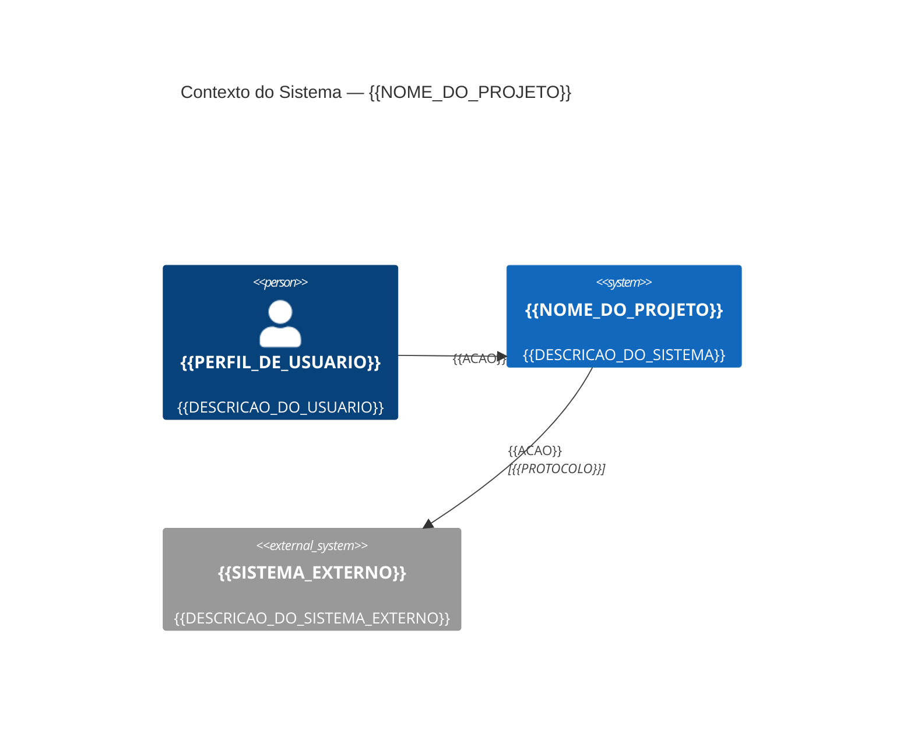
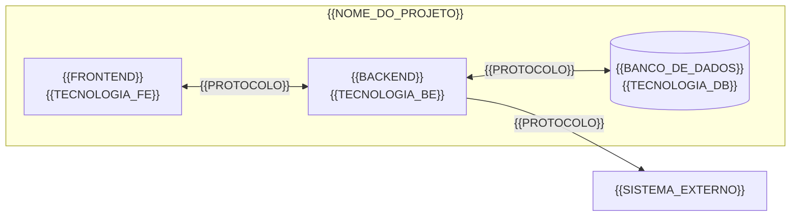

# Arquitetura — {{NOME_DO_PROJETO}}

| Campo | Valor |
|:---|:---|
| **Padrão arquitetural** | `{{PADRAO_ARQUITETURAL}}` |
| **Versão** | `{{VERSAO}}` |
| **Atualizado em** | `{{DATA}}` |

---

## 1. Diagrama de Contexto (Nível C4 — Contexto)



<!-- ALTERNATIVA: Use flowchart se C4 não estiver disponível no renderizador -->
<!--
```mermaid
flowchart TD
    U["{{USUARIO}}"] - -> A["{{SISTEMA}}"]
    A - -> B["{{SERVICO}}"]
    B - -> C[("{{BANCO_DE_DADOS}}")]
    A - -> D["{{SISTEMA_EXTERNO}}"]
```
-->

---

## 2. Diagrama de Contêineres (Nível C4 — Contêiner)



---

## 3. Componentes Principais

| Componente | Tecnologia | Responsabilidade |
|:---|:---|:---|
| {{COMPONENTE}} | {{TECNOLOGIA}} | {{RESPONSABILIDADE}} |

---

## 4. Decisões Arquiteturais (ADRs)

### ADR-{{NNN}}: {{TITULO_DA_DECISAO}}

| Campo | Valor |
|:---|:---|
| **Data** | `{{DATA}}` |
| **Status** | `{{STATUS}}` <!-- Proposta | Aprovada | Depreciada --> |
| **Decisores** | `{{DECISORES}}` |

**Contexto:**
{{CONTEXTO_DA_DECISAO}}

**Decisão:**
{{DECISAO_TOMADA}}

**Alternativas consideradas:**
- {{ALTERNATIVA_1}}
- {{ALTERNATIVA_2}}

**Consequências:**
- {{CONSEQUENCIA_POSITIVA}}
- {{CONSEQUENCIA_NEGATIVA}}

---

<!-- TEMPLATE DE ADR ADICIONAL: Copie o bloco acima para cada nova decisão -->

---

## 5. Matriz de Riscos Técnicos <!-- RECOMENDADO para projetos privados corporativos -->

| Risco | Probabilidade | Impacto | Mitigação |
|:---|:---:|:---:|:---|
| {{RISCO}} | `Alta / Média / Baixa` | `Alto / Médio / Baixo` | {{MITIGACAO}} |

---

## 6. Considerações de Segurança Arquitetural

- Nunca versionar `.env` real, tokens, chaves privadas ou credenciais.
- Usar `.env.example` apenas com nomes de variáveis e valores fictícios.
- Executar verificação de segredos antes de releases (`git-secrets`, `trufflehog` ou equivalente).
- Registrar logs sem dados pessoais, tokens, caminhos locais ou conteúdo privado.
- Validar inputs em todas as fronteiras do sistema (controllers, gateways, parsers).
