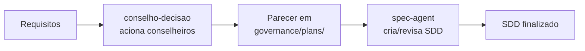

# Contrato de Entrada/Saída — Apoio do Conselho à Criação de SDD

## Objetivo

Definir o formato de input e output para o apoio do Conselho de Decisão na criação e revisão de Software Design Documents (SDD).

O conselho **apoia** o `spec-agent`, não o substitui. O parecer do conselho é um insumo para o autor do SDD.

---

## Entradas (Input)

O conselho precisa receber:

| Item | Formato | Obrigatório | Exemplo |
|:---|:---|:---:|:---|
| Requisitos funcionais | Lista ou documento | Sim | "RF001: Usuário pode fazer login com email e senha" |
| Requisitos não funcionais | Lista ou documento | Sim | "RNF001: Tempo de resposta < 2s" |
| Restrições conhecidas | Lista | Sim | "Deve funcionar offline", "LGPD aplicável" |
| Spec preliminar (opcional) | Texto livre | Não | Rascunho do SDD |
| Contexto arquitetural | Referência | Não | "Arquitetura atual usa BLoC + SQLite" |

---

## Saídas (Output)

O conselho produz:

| Artefato | Formato | Dono | Destino |
|:---|:---|:---|:---|
| Parecer do Conselho | Markdown | `conselho-decisao` | `governance/plans/YYYYMMDD-slug.parecer.md` |
| SDD resultante (ajustado) | Markdown | `spec-agent` | Conforme fluxo Spec Kit |

### Estrutura do Parecer

```markdown
## Parecer do Conselho de Decisão — [Título do SDD]

### Demanda
[descrição do SDD solicitado]

### Conselheiros acionados
- `caminho-correto`: [validação de conformidade com requisitos]
- `caca-falhas`: [riscos e edge cases identificados]
- `fora-da-caixa`: [alternativas de design]
- `leigo-radical`: [simplificações e questionamentos]

### Consolidação
- **Aprovado para especificação:** [sim/não/condicional]
- **Lacunas identificadas:** [lista]
- **Riscos:** [lista]
- **Recomendações:** [lista]
- **Próximos passos:** [handoff para spec-agent, ajustes necessários]
```

---

## Fluxo de Acionamento



---

## Critérios de Acionamento

O conselho DEVE ser acionado para SDD quando:

- Projeto exige SDD formal (recomendado)
- Há risco técnico ou de negócio significativo
- A decisão de design tem impacto arquitetural amplo
- Múltiplas alternativas de solução são viáveis

O conselho NÃO DEVE ser acionado para SDD quando:

- SDD é trivial ou padronizado
- A decisão já foi validada por autoridade competente
- O custo de contexto do conselho supera o benefício esperado
