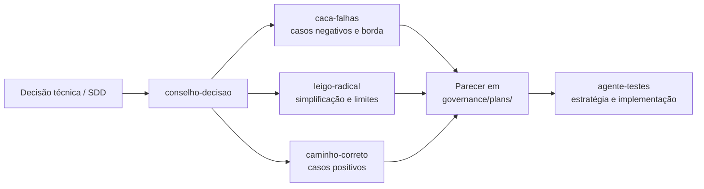

# Contrato de Entrada/Saída — Apoio do Conselho à Derivação de Testes

## Objetivo

Definir o formato de input e output para o apoio do Conselho de Decisão na derivação de casos de teste a partir de decisões técnicas e SDDs.

O conselho **apoia** o `agente-testes`, não o substitui. O parecer do conselho fornece insumos para a estratégia de testes.

---

## Entradas (Input)

O conselho precisa receber:

| Item | Formato | Obrigatório | Exemplo |
|:---|:---|:---:|:---|
| Decisão técnica ou SDD | Documento | Sim | SDD da feature de login |
| Requisitos associados | Lista | Sim | "RF001: Login com email e senha" |
| Critérios de aceite | Lista | Não | "CA001: Login inválido mostra erro em < 1s" |
| Restrições de ambiente | Lista | Não | "Android 8+, iOS 14+, offline-first" |

---

## Saídas (Output)

O conselho produz:

| Artefato | Formato | Dono | Destino |
|:---|:---|:---|:---|
| Parecer de testes | Markdown | `conselho-decisao` | `governance/plans/YYYYMMDD-slug.parecer.md` |
| Casos de teste (insumo) | Lista | `caca-falhas` + `leigo-radical` | Anexo ao parecer |

### Estrutura do Parecer de Testes

```markdown
## Parecer de Derivação de Testes — [Título da Decisão]

### Demanda
[descrição da decisão ou SDD]

### Casos Positivos
- [ ] [CT001] [descrição] — [requisito relacionado]
- [ ] [CT002] [descrição] — [requisito relacionado]

### Casos Negativos
- [ ] [CT003] [descrição do cenário de erro] — [requisito relacionado]
- [ ] [CT004] [descrição do cenário de erro] — [requisito relacionado]

### Casos de Borda
- [ ] [CT005] [descrição do limite] — [justificativa]
- [ ] [CT006] [descrição do limite] — [justificativa]

### Comportamentos Proibidos
- [ ] [CT007] [descrição do que não deve acontecer] — [justificativa]

### Riscos não cobertos
[lista de cenários que podem exigir testes adicionais]
```

---

## Categorias de Teste

| Categoria | Descrição | Conselheiro responsável |
|:---|:---|:---|
| Positivo | Fluxo principal funciona conforme esperado | `caminho-correto` |
| Negativo | Erros e exceções são tratados corretamente | `caca-falhas` |
| Borda | Limites de entrada, estado e integração | `caca-falhas` + `leigo-radical` |
| Proibido | Comportamentos que nunca devem ocorrer | `caca-falhas` |

---

## Fluxo de Acionamento



---

## Critérios de Acionamento

O conselho DEVE ser acionado para testes quando:

- Decisão técnica envolve risco de regressão
- Feature tem múltiplos estados ou fluxos condicionais
- Há requisitos não funcionais críticos (performance, segurança)
- O `agente-testes` solicita apoio na identificação de cenários

O conselho NÃO DEVE ser acionado para testes quando:

- Testes são triviais ou cobertos por padrão existente
- A decisão já possui cobertura de testes completa
- O custo de contexto do conselho supera o benefício
