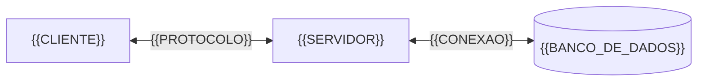

# Software Design Document — {{NOME_DO_PROJETO}}

| Campo | Valor |
|:---|:---|
| **Tipo do projeto** | `{{TIPO_DO_PROJETO}}` <!-- PRIVADO | SHOWCASE | SITE --> |
| **Versão do documento** | `{{VERSAO_DO_DOCUMENTO}}` |
| **Status** | `{{STATUS}}` <!-- EM ANÁLISE | APROVADO | OBSOLETO --> |
| **Data** | `{{DATA}}` |
| **Autores** | `{{AUTORES}}` |
| **Revisores** | `{{REVISORES}}` <!-- OPCIONAL --> |

---

## 1. Introdução

### 1.1 Propósito

{{DESCRICAO_DO_PROPOSITO_DO_SISTEMA}}

### 1.2 Escopo

**Dentro do escopo:**
- {{ITEM_NO_ESCOPO}}

**Fora do escopo:**
- {{ITEM_FORA_DO_ESCOPO}}

### 1.3 Glossário

| Termo | Definição |
|:---|:---|
| {{TERMO}} | {{DEFINICAO}} |

### 1.4 Referências

- {{REFERENCIA}} <!-- link, documento ou especificação externa -->

---

## 2. Visão Geral do Sistema

{{DESCRICAO_DO_CONTEXTO_OPERACIONAL}}

**Usuários primários:** {{USUARIOS}}
**Restrições de ambiente:** {{RESTRICOES_DE_INFRAESTRUTURA}}

---

## 3. Arquitetura do Sistema

### 3.1 Diagrama de componentes



### 3.2 Componentes

| Componente | Responsabilidade | Tecnologia |
|:---|:---|:---|
| {{COMPONENTE}} | {{RESPONSABILIDADE}} | {{TECNOLOGIA}} |

### 3.3 Fluxo de dados

{{DESCRICAO_DO_FLUXO_DE_DADOS}}

---

## 4. Design Detalhado

### 4.1 Organização do código

<!-- Descreva a convenção arquitetural (ex: MVVM, Clean Arch, MVC, DDD) e a distribuição de responsabilidades entre camadas. -->

{{DESCRICAO_DA_ARQUITETURA_INTERNA}}

### 4.2 Padrões e convenções

- **Nomenclatura:** {{CONVENCAO_DE_NOMENCLATURA}}
- **Injeção de dependência:** {{ESTRATEGIA_DE_DI}}
- **Tratamento de erros:** {{ESTRATEGIA_DE_ERROS}}

---

## 5. Dados e Persistência

### 5.1 Banco de dados

**Tipo:** `{{TIPO_DE_BANCO}}` | **Versão:** `{{VERSAO_DO_BANCO}}`

### 5.2 Modelo de dados

| Entidade | Campos principais | Relacionamentos |
|:---|:---|:---|
| `{{ENTIDADE}}` | `{{CAMPOS}}` | `{{RELACIONAMENTOS}}` |

### 5.3 Migrações

{{ESTRATEGIA_DE_MIGRACOES}}

---

## 6. Interfaces Externas

### 6.1 APIs

| Endpoint | Método | Autenticação | Descrição |
|:---|:---:|:---|:---|
| `{{ENDPOINT}}` | `{{METODO}}` | `{{AUTENTICACAO}}` | {{DESCRICAO}} |

> **Segurança:** Documente apenas o contrato da interface. Não exponha URLs de homologação/produção ou tokens.

### 6.2 UI/UX

<!-- OPCIONAL: Descreva padrões visuais mínimos, alvos de toque e acessibilidade. -->

{{DESCRICAO_DE_UI}}

---

## 7. Segurança

### 7.1 Autenticação

**Mecanismo:** `{{MECANISMO}}` <!-- JWT, OAuth2, API Key, Session -->

### 7.2 Autorização

**Modelo:** `{{MODELO}}` <!-- RBAC, ABAC, ACL -->

| Perfil | Permissões |
|:---|:---|
| `{{PERFIL}}` | {{PERMISSOES}} |

### 7.3 Criptografia

- **Em trânsito:** `{{PROTOCOLO_TLS}}`
- **Em repouso:** `{{ESTRATEGIA_DE_CRIPTOGRAFIA}}`

### 7.4 Sanitização e compliance

- {{REGRA_DE_SANITIZACAO}} <!-- ex: CPFs nunca gravados em logs -->
- {{COMPLIANCE}} <!-- ex: LGPD, PCI-DSS -->

> **Crítico:** Nunca registre credenciais, tokens ou dados pessoais em logs de execução.

---

## 8. Performance e Escalabilidade

| Métrica | Valor alvo | Condição |
|:---|:---|:---|
| Tempo de resposta | `{{TEMPO}}ms` | {{CONDICAO}} |
| Throughput | `{{REQUISICOES}}/s` | {{CONDICAO}} |
| {{METRICA}} | `{{VALOR}}` | {{CONDICAO}} |

**Estratégias aplicadas:**
- {{ESTRATEGIA}} <!-- ex: cache em Redis, lazy loading, paginação -->

---

## 9. Testes e Validação

| Tipo | Cobertura mínima | Ferramenta |
|:---|:---:|:---|
| Unitário | `{{COBERTURA}}%` | {{FERRAMENTA}} |
| Integração | `{{COBERTURA}}%` | {{FERRAMENTA}} |
| E2E <!-- OPCIONAL --> | `{{COBERTURA}}%` | {{FERRAMENTA}} |

**Checklist pré-release:**
- [ ] Testes unitários passando sem falhas
- [ ] Testes de integração executados em ambiente isolado
- [ ] Análise estática (lint) sem erros críticos
- [ ] Verificação de segredos no diff (secret scanning)

---

## 10. Implantação e Operação

### 10.1 Pipeline CI/CD

**Plataforma:** `{{PLATAFORMA_CI_CD}}`

| Etapa | Trigger | Ação |
|:---|:---|:---|
| `{{ETAPA}}` | `{{TRIGGER}}` | {{ACAO}} |

### 10.2 Ambientes

| Ambiente | Propósito |
|:---|:---|
| `development` | {{DESCRICAO}} |
| `staging` <!-- OPCIONAL --> | {{DESCRICAO}} |
| `production` | {{DESCRICAO}} |

> **Segurança:** Não registre IPs, senhas de painel ou strings de conexão de produção neste documento.

### 10.3 Observabilidade

- **Logs:** {{ESTRATEGIA_DE_LOGS}}
- **Métricas:** {{ESTRATEGIA_DE_METRICAS}} <!-- OPCIONAL -->
- **Alertas:** {{ESTRATEGIA_DE_ALERTAS}} <!-- OPCIONAL -->

---

## 11. Manutenção e Evolução

### 11.1 Dívida técnica conhecida

| Item | Impacto | Prioridade |
|:---|:---|:---:|
| {{ITEM}} | {{IMPACTO}} | `{{PRIORIDADE}}` |

### 11.2 Riscos operacionais

| Risco | Probabilidade | Mitigação |
|:---|:---:|:---|
| {{RISCO}} | `{{PROBABILIDADE}}` | {{MITIGACAO}} |

---

## 12. Apêndices <!-- OPCIONAL -->

### A. Exemplos de payload

```json
{
  "{{campo}}": "{{valor_exemplo}}"
}
```

### B. Links e referências externas

- {{LINK}}
